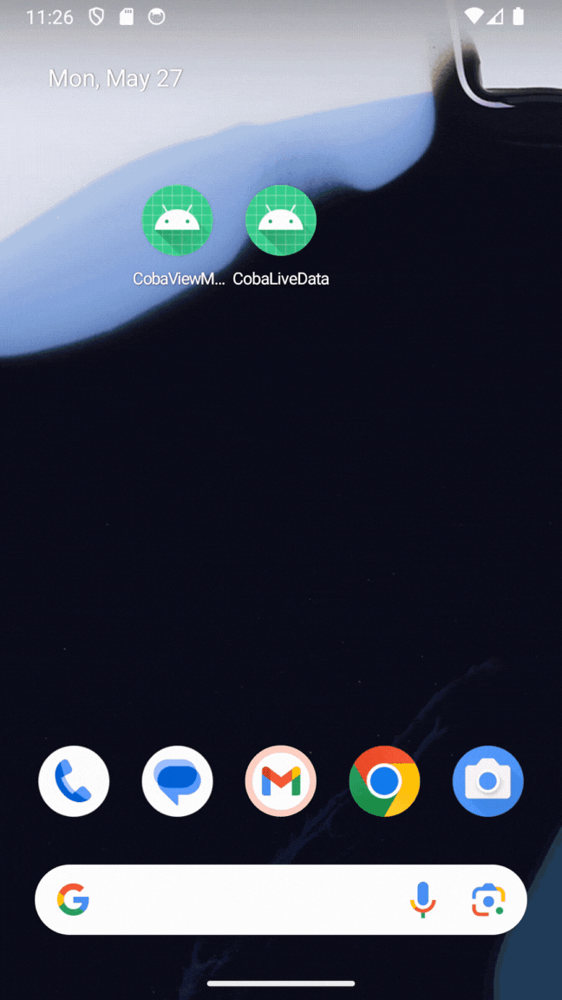

#### [Materi LiveData](../SubMateri/3.LiveData.md)

# CodeLab LiveData
1. Buat project baru:

    

2. Tambahkan library architecture component ke dalam proyek pada **build.gradle.kts(module:app)**, dan tambahkan kode seperti berikut:

    ```dependencies
    dependencies {
        ...
        implementation("androidx.lifecycle:lifecycle-viewmodel-ktx:2.6.2")
        implementation("androidx.lifecycle:lifecycle-livedata-ktx:2.6.2")
    }
    ```

    Lalu klik **Sync Now** di pojok kanan atas supaya library terunduh.

3. Aktifkan viewbinding pada **build.gradle.kts(module:App)** seperti berikut:

    ```android
    android {
        ...
    
        buildFeatures {
            viewBinding = true
        }
    }
    ```

    Lalu klik **Sync Now** di pojok kanan.

4. Buka layout **activity_main.xml**, kemudian tambahkan kode di dalamnya seperti berikut:

    ```activity_main.xml
    <?xml version="1.0" encoding="utf-8"?>
    <androidx.constraintlayout.widget.ConstraintLayout xmlns:android="http://schemas.android.com/apk/res/android"
        xmlns:app="http://schemas.android.com/apk/res-auto"
        xmlns:tools="http://schemas.android.com/tools"
        android:id="@+id/main"
        android:layout_width="match_parent"
        android:layout_height="match_parent"
        android:padding="16dp"
        tools:context=".MainActivity">

        <TextView
            android:id="@+id/timer_textview"
            android:layout_width="wrap_content"
            android:layout_height="wrap_content"
            android:textSize="20sp"
            app:layout_constraintBottom_toTopOf="@+id/start_button"
            app:layout_constraintEnd_toEndOf="parent"
            app:layout_constraintStart_toStartOf="parent"
            app:layout_constraintTop_toTopOf="parent" />

        <Button
            android:id="@+id/start_button"
            android:layout_width="wrap_content"
            android:layout_height="wrap_content"
            android:text="Start Timer"
            app:layout_constraintBottom_toBottomOf="parent"
            app:layout_constraintEnd_toEndOf="parent"
            app:layout_constraintStart_toStartOf="parent"
            app:layout_constraintTop_toBottomOf="@+id/timer_textview"
            app:layout_constraintVertical_bias="0.1" />

    </androidx.constraintlayout.widget.ConstraintLayout>
    ```

5. Buka berkas **strings.xml** dan tambahkan resource string-nya seperti berikut:


    ```strings.xml
    <resources>
        <string name="app_name">CobaLiveData</string>
        <string name="seconds">%d seconds elapsed</string>
    </resources>
    ```

6. Buat kelas baru dengan nama **MainViewModel**, lalu tambahkan kode pada kelas tersebut menjadi seperti berikut:

    ```MainViewModel.kt
    class MainViewModel : ViewModel() {

        companion object {
            private const val ONE_SECOND = 1000
        }

        private val mInitialTime = MutableLiveData<Long?>()
        private val mElapsedTime = MutableLiveData<Long?>()
        private var timer: Timer? = null

        fun startTimer() {
            mInitialTime.value = SystemClock.elapsedRealtime()
            timer = Timer()
            timer?.schedule(object : TimerTask() {
                override fun run() {
                    val initialTime = mInitialTime.value ?: return
                    val newValue = (SystemClock.elapsedRealtime() - initialTime) / 1000
                    mElapsedTime.postValue(newValue)
                }
            }, ONE_SECOND.toLong(), ONE_SECOND.toLong())
        }

        fun getElapsedTime(): LiveData<Long?> {
            return mElapsedTime
        }

        override fun onCleared() {
            super.onCleared()
            timer?.cancel()
        }
    }
    ```

    - companion object digunakan untuk mendefinisikan konstanta yang bisa diakses seperti anggota statis. ONE_SECOND adalah konstanta yang nilainya 1000 milidetik (1 detik).

    - mInitialTime dan mElapsedTime adalah instance dari MutableLiveData yang akan menyimpan data waktu awal dan waktu yang telah berlalu.

    - timer adalah objek Timer yang digunakan untuk menjadwalkan tugas berulang.

    - startTimer() menginisialisasi waktu awal dengan SystemClock.elapsedRealtime(), yang mengembalikan waktu dalam milidetik sejak sistem boot.

    - Membuat objek Timer baru.

    - Menjadwalkan TimerTask yang berjalan setiap detik (ONE_SECOND).

    - Di dalam TimerTask, waktu yang telah berlalu dihitung dengan mengurangkan initialTime dari waktu saat ini dan membaginya dengan 1000 untuk mengkonversi dari milidetik ke detik.

    - mElapsedTime.postValue(newValue) digunakan untuk memperbarui nilai yang diamati oleh LiveData pada thread utama.

    - getElapsedTime() mengembalikan LiveData yang dapat diamati oleh UI untuk mendapatkan pembaruan waktu yang telah berlalu.

    - onCleared() dipanggil ketika ViewModel tidak lagi digunakan dan akan dihapus. Di sini, timer dibatalkan untuk mencegah kebocoran memori.

7. Tambahkan kode pada kelas **MainActivity** menjadi seperti berikut:

    ```MainActivity.kt
    class MainActivity : AppCompatActivity() {

        private lateinit var liveDataTimerViewModel: MainViewModel
        private lateinit var activityMainBinding: ActivityMainBinding

        override fun onCreate(savedInstanceState: Bundle?) {
            super.onCreate(savedInstanceState)

            activityMainBinding = ActivityMainBinding.inflate(layoutInflater)
            setContentView(activityMainBinding.root)

            liveDataTimerViewModel = ViewModelProvider(this)[MainViewModel::class.java]
            subscribe()

            activityMainBinding.startButton.setOnClickListener {
                liveDataTimerViewModel.startTimer()
            }
        }

        private fun subscribe() {
            val elapsedTimeObserver = Observer<Long?> { aLong ->
                val newText = this@MainActivity.resources.getString(R.string.seconds, aLong)
                activityMainBinding.timerTextview.text = newText
            }
            liveDataTimerViewModel.getElapsedTime().observe(this, elapsedTimeObserver)
        }
    }
    ```

    - liveDataTimerViewModel dan activityMainBinding adalah properti yang akan diinisialisasi nanti (lateinit). liveDataTimerViewModel adalah instance dari MainViewModel yang bertanggung jawab untuk mengelola data dan logika aplikasi. activityMainBinding digunakan untuk mengikat layout XML dengan kode Kotlin menggunakan fitur View Binding.

    - onCreate adalah metode yang dipanggil saat Activity dibuat. Ini adalah tempat untuk menginisialisasi Activity, mengatur layout, dan mempersiapkan komponen-komponen yang diperlukan.

    - Menggunakan View Binding untuk menginflate layout dan mengatur tampilan dengan activityMainBinding.

    - Menginisialisasi liveDataTimerViewModel menggunakan ViewModelProvider untuk memastikan ViewModel yang sama digunakan saat konfigurasi perangkat berubah (misalnya rotasi layar). subscribe() dipanggil untuk mengamati perubahan data dari ViewModel.

    - Menetapkan OnClickListener untuk startButton. Saat tombol diklik, metode startTimer() dari liveDataTimerViewModel dipanggil untuk memulai timer.

    - subscribe() mengatur sebuah observer untuk LiveData elapsedTime dari liveDataTimerViewModel. Observer ini akan dipanggil setiap kali elapsedTime berubah.

    - elapsedTimeObserver adalah sebuah Observer yang menerima nilai baru dari LiveData (aLong), kemudian mengupdate timerTextview dengan teks baru yang diformat menggunakan resource string R.string.seconds dan nilai aLong.

8. Jalankan aplikasi yang sudah dibuat, lakukan perubahan orientasi layarnya Untuk melihat apakah waktu pada aplikasi bisa dijaga dengan baik oleh kelas MainViewModel seperti berikut:

    