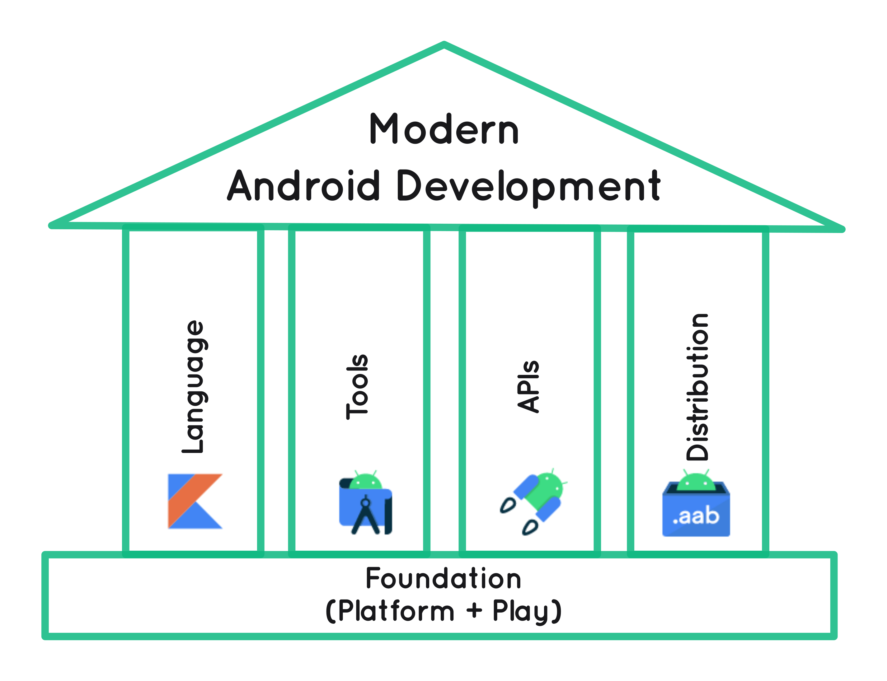
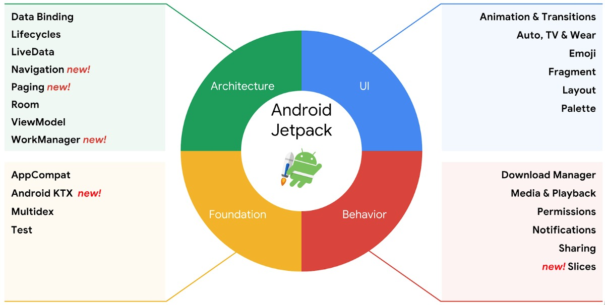
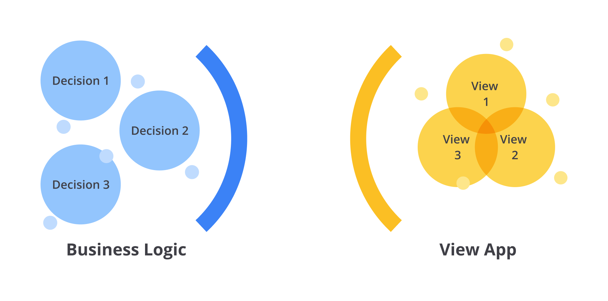
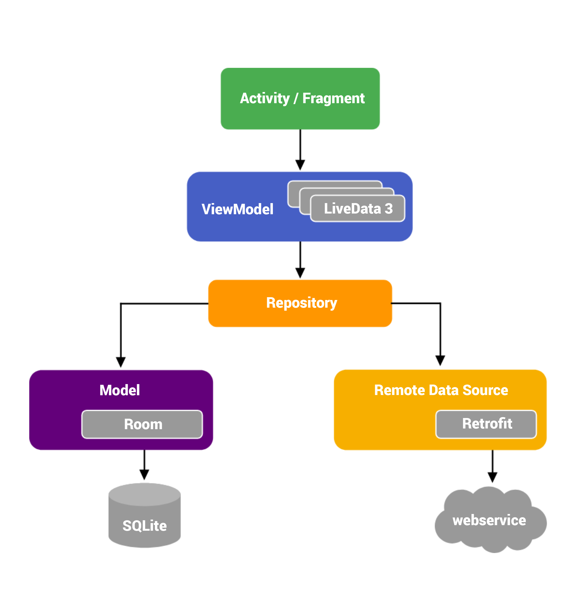

#### [<<<<<< Main](../Materi.md)

# Overview

## Modern Android Development
Hal paling penting dalam membuat aplikasi android, yaitu menerapkan best practice dari rekomendasi tim android.

Perkembangan android berupa penambahan atau update fitur bertujuan agar performa menjadi semakin baik.

Supaya tetap pada best practice dan up to date maka diperkenalkan konsep modern android development, yaitu blueprint untuk menghasilkan aplikasi yang bagus dan kompatibel.

4 pilar modern android development, yaitu:
1. Language 
   Android merekomendasikan Kotlin, karena bersifat ringkas, cepat, aman, dan interoperability. Dengan sifatnya ini, kurang lebih 95% dari 1000 aplikasi teratas di Play Store menggunakan Kotlin.

2. Tools
   Android Studio menjadi pilihan terbaik karena telah mencakup semua kebutuhan pengembangan dari awal sampai akhir, mulai dari template, desain dengan layout editor, testing dengan emulator, export file, dll.

3. API
   API ini menggunakan komponen Android jetpack.

4. Distribution
   AAB (Android App Bundle) merupakan format terbaik karena sifatnya yang dinamis dimana dapat mengunduh bagian yang diperlukan saja (bahasa, arsitektur, density) yang membuat ukuran aplikasi menjadi jauh lebih kecil.

## Android Jetpack
Android jetpack dipublikasikan pada google I/O 2018.

Jetpack merupakan komponen library, tools, serta panduan untuk membbuat aplikasi android yang baik.

Jetpack terdiri dari beberapa paket library dengan awalan android yang terpisah dari API platform.

Jetpack sering diperbarui dan juga memiliki kompatibilitas dengan versi sebelumnya.

Pada Play Store kurang lebih 79% dari 1000 aplikasi teratas menggunakan minimal 2 jetpack library (kecuali core library, seperti AppCompat dan Lifecycle).

Keuntungan menggunakan android jetpack, yaitu:
1. Mengikuti best practice
   Memungkinkan untuk mengurangi tingkat crash dan mencegah memory leaks.

2. Mengurangi kode boilerplate
   Mampu untuk mengelola kode yang berulang-ulang, seperti background task, navigation, manajemen lifecycle.

3. Mengatasi fragmentation
   Fragmentation merupakan penggunaan kode yang berbeda untuk versi android yang berbeda, sehingga diperlukan logika percabangan.

Tujuan dibuatnya android jetpack adalah agar komponen-komponen terkumpul menjadi satu sehingga memudahkan untuk dipelajari. [Komponen-komponen](https://developer.android.com/jetpack/androidx/explorer?case=all) ini terdiri dari 9 bagian, yaitu:
1. Beyond Phones
   Digunakan untuk membuat aplikasi android pada device selain telepon biasa.

2. Data
   Digunakan untuk mengolah data.

3. Graphics
   Digunakan untuk mengatur gambar visual.

4. Lifecycle
   Digunakan untuk mengatur lifecycle.

5. Media
   Berhubungan dengan media.

6. Navigation
   Digunakan untuk berpindah antar-activity/fragment.

7. Security
   Digunakan untuk keamanan.

8. Performance/Test
   Digunakan untuk melihat performa atau melakukan testing.

9. UI
   Berhubungan dengan UI.

## Architecture
### Architecture Pattern
Architecture pattern bertujuan agar aplikasi mudah dikelola, diuji, dan dipahami.

Separation of concerns (SoC) merupakan pemisahan antara kode business logic dengan UI.

Dengan menerapkan SoC, maka architecture pattern dapat dicapai dan menghindari technical debt, yaitu penumpukan masalah akibat tidak menerapkan konsep architecture yang baik.

### Android Architecture Component
Merupakan konsep architecture pattern yang dibungkus dalam android jetpack dimana dipublikasikan pada Google I/O 2017.

Terdiri dari kumpulan library untuk merancang aplikasi yang kuat serta dapat diuji dan dikelola dengan mudah.

Penjelasan bagian dari android architecture component, yaitu:
1. View
   Berfungsi sebagai UI controller (fragmet atau activity) yakni untuk menampilkan data, mempertahankan data, memberikan aksi terhadap tindakan pengguna, menangani komunikasi sistem informasi (permission atau perizinan).

2. ViewModel
   Sebagai pusat komunikasi antara repository dengan UI, yakni dengan memberikan data dari repository ke UI. ViewModel ini bertugas untuk memepertahankan data dari comfiguration changes.

3. LiveData
   Kelas pemegang data yang dapat di-observe, dimana datanya selalu update.

4. Repository
   Untuk mengelola banyak sumber data, seperti berasal dari network, local, atau cache.

5. Room
   Merupakan sumber data yang berasal dari local database. Library room ini menyediakan abstraksi terhadap SQLite yang memungkinkan akses terhadap database menjadi lebih kuat.

6. Rest Client
   Merupakan sumber data yang berasal dari network, seperti Rest API, firebase, dsb.

# Referensi
1. [Modern Android Development - developer android](https://developer.android.com/modern-android-development)
2. [Android Jetpack - developer android](https://developer.android.com/jetpack)
3. [Architecture - developer android](https://developer.android.com/topic/architecture)

#### [ViewModel >>>>>>](2.ViewModel.md)