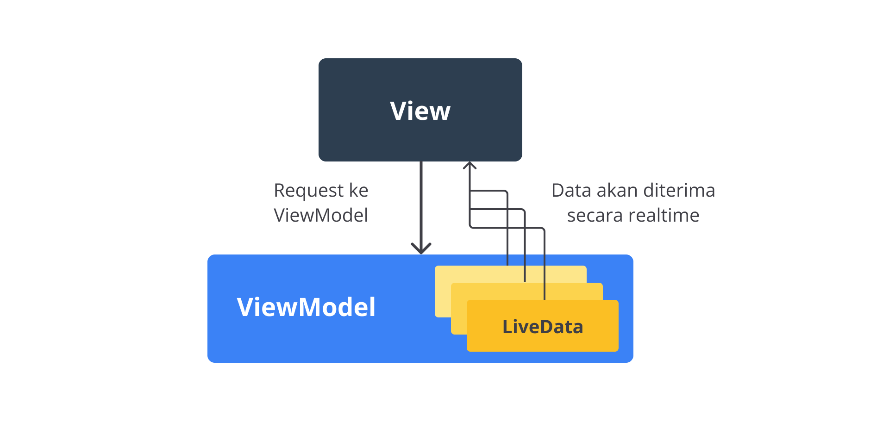

#### [CodeLab LiveData](../CodeLab/3.LiveData.md)

#### [<<<<<< ViewModel](2.ViewModel.md)

# LiveData
LiveData adalah observable class holder yang akan memberikan pemberitahuan jika terjadi perubahan data, dimana LiveData bersifat Lifecycle-Aware, yang berarti bahwa LiveData dapat merespon perubahan yang ada di Lifecycle (Activity, Fragment, atau Service).

LiveData hanya akan memperbarui komponen pengamat atau observers ketika Lifecycle aplikasi dalam keadaan aktif. 



Keuntungan menggunakan LiveData, yaitu sebagai berikut:
1. UI akan selalu mendapatkan data akurat.

2. Tidak akan menyebabkan memory leak.

3. Aplikasi tidak akan crash jika keluar/stop Activity.

4. Tidak perlu melakukan perubahan UI secara manual berkaitan dengan update data.

5. LiveData akan selalu memperbarui data. Jika lifecycle menjadi tidak aktif, ia menerima data terbaru setelah menjadi aktif kembali.

6. Mampu mempertahankan data ketika terjadi perubahan konfigurasi, seperti rotasi perangkat.

7. Berbagi sumber daya, dapat memperluas obyek LiveData menggunakan Singleton Pattern untuk membungkus layanan Service sehingga dapat dibagikan.

#### Langkah-langkah membuat aplikasi dengan obyek LiveData, yaitu:
1. Buat LiveData untuk menampung tipe data tertentu. Biasanya dilakukan pada kelas ViewModel.

2. Buat obyek Observer yang mendefinisikan metode onChanged(), dimana ketika terjadi perubahan maka akan mengontrol apa yang terjadi pada data yang disimpan objek LiveData. Biasanya dilakukan pada UI controller, seperti Activity atau Fragment.

3. Lampirkan obyek Observer ke obyek LiveData menggunakan metode observe(). Metode observe() akan mengambil obyek LifecycleOwner sebagai obyek Observer dari objek LiveData sehingga akan ada pemberitahuan tentang perubahan. Biasanya dilakukan dalam UI controller, seperti Activity atau Fragment.

LiveData adalah pembungkus yang dapat digunakan untuk membungkus data apapun, termasuk obyek yang mengimplementasikan Collection, seperti List. Obyek LiveData biasanya disimpan dalam obyek ViewModel dan diakses melalui metode getter, seperti berikut:
```kotlin
class MyViewModel : ViewModel() {
    private lateinit var name: MutableLiveData<String>
 
    fun getName(): LiveData<String> {
        name = MutableLiveData()
        return name
    }
}
```

Dalam kebanyakan kasus, komponen aplikasi seperti metode onCreate() adalah tempat yang tepat untuk memulai proses observe obyek LiveData, alasannya sebagai berikut:
1. Untuk memastikan sistem tidak melakukan panggilan berulang atau panggilan yang tidak perlu dilakukan dari suatu Activity atau metode onResume() pada Fragment.

2. LiveData juga berfungsi untuk memastikan apakah ada perubahan data yang bisa segera ditampilkan dalam Activity atau Fragment. Setelah komponen aplikasi dalam status STARTED, UI controller akan menerima value terbaru dari obyek LiveData yang di-observe. Hal tersebut hanya akan terjadi jika obyek LiveData yang akan diamati sudah dalam keadaan ready.

3. Contoh kode untuk meng-observe obyek LiveData:
   ```kotlin
    class MainActivity : AppCompatActivity() {
 
        private lateinit var viewModel: MyViewModel
    
        override fun onCreate(savedInstanceState: Bundle?) {
            super.onCreate(savedInstanceState)
            // Other code to setup the activity...
    
            // Get the ViewModel.
            viewModel = ViewModelProvider(this)[MyViewModel::class.java]
    
            // Create the observer which updates the UI.
            val nameObserver: Observer<String> = Observer { newName ->
                // Update the UI, in this case, a TextView.
                nameTextView.setText(newName)
            }
    
            // Observe the LiveData, passing in this activity as the LifecycleOwner and the observer.
            viewModel.getName().observe(this, nameObserver)
        }
    }
   ```

Berbeda dengan LiveData, MutableLiveData memiliki akses untuk mengubah data. Biasanya kelas MutableLiveData hanya digunakan di dalam ViewModel, kemudian ViewModel hanya akan mengirimkan kepada observers berupa LiveData yang tidak dapat diubah atau immutable.

Kelas MutableLiveData mempunyai 2 metode yang bisa digunakan untuk mengedit nilai yang disimpan dalam obyek LiveData, yaitu :
1. setValue() dipakai saat di main thread.

2. postValue() dipakai saat di background thread.

Contoh penerapan fungsi setValue() untuk mengubah data name yang ada di MyViewModel:
```kotlin
button.setOnClickListener {
    val anotherName = "Another Name"
    viewModel.getName().setValue(anotherName)
}
```

Saat memanggil setValue (T) dalam contoh di atas, pengamat atau observer akan memanggil metode onChanged() dengan nilai “Another Name”. Pemanggilan setValue() atau postValue() pada kode di atas dicontohkan dengan penggunaan onClick pada Button. Namun setValue() atau postValue() dapat dipanggil untuk memperbarui anotherName dengan berbagai alasan atau kondisi. Kondisi tersebut termasuk ketika harus menanggapi request dari network atau penyelesaian proses memuat database. Dalam semua kasus, panggilan ke setValue() atau postValue() memicu pengamat atau observer dan memperbarui UI.

# Referensi
1. [LiveData - developer android](https://developer.android.com/topic/libraries/architecture/livedata)