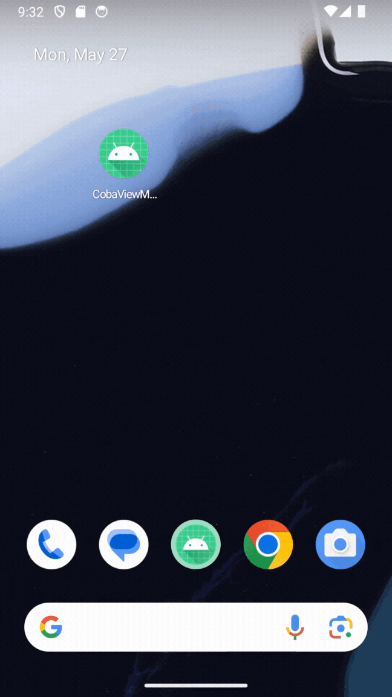

#### [Materi ViewModel](../SubMateri/2.ViewModel.md)

# CodeLab ViewModel
1. Buat project baru:
    
2. Tambahkan library viewmodel pada **build.gradle.kts(module:App)** seperti berikut:

    ```dependencies
    dependencies {
        ...
        implementation("androidx.lifecycle:lifecycle-viewmodel-ktx:2.6.2")
        implementation("androidx.activity:activity-ktx:1.8.0")
    }
    ```

    Lalu klik **Sync Now** di pojok kanan atas supaya library terunduh.

3. Aktifkan viewbinding pada **build.gradle.kts(module:App)** seperti berikut:

    ```android
    android {
        ...
    
        buildFeatures {
            viewBinding = true
        }
    }
    ```

    Lalu klik **Sync Now** di pojok kanan.

4. Buka layout **activity_main.xml**, kemudian tambahkan kode di dalamnya seperti berikut:

    ```activitu_main.xml
    <?xml version="1.0" encoding="utf-8"?>
    <ScrollView xmlns:android="http://schemas.android.com/apk/res/android"
        xmlns:tools="http://schemas.android.com/tools"
        android:id="@+id/main"
        android:layout_width="match_parent"
        android:layout_height="match_parent"
        android:scrollbars="vertical"
        android:padding="16dp"
        tools:context=".MainActivity">

        <LinearLayout
            android:layout_width="match_parent"
            android:layout_height="wrap_content"
            android:orientation="vertical" >

            <TextView
                android:layout_width="match_parent"
                android:layout_height="wrap_content"
                android:textSize="20sp"
                android:textStyle="bold"
                android:text="@string/volume_balok" />

            <TextView
                android:layout_width="match_parent"
                android:layout_height="wrap_content"
                android:layout_marginTop="30dp"
                android:text="@string/length" />

            <EditText
                android:id="@+id/edt_length"
                android:layout_width="match_parent"
                android:layout_height="wrap_content"
                android:layout_marginBottom="16dp"
                android:inputType="numberDecimal"
                android:lines="1" />

            <TextView
                android:layout_width="match_parent"
                android:layout_height="wrap_content"
                android:text="@string/width" />

            <EditText
                android:id="@+id/edt_width"
                android:layout_width="match_parent"
                android:layout_height="wrap_content"
                android:layout_marginBottom="16dp"
                android:inputType="numberDecimal"
                android:lines="1" />

            <TextView
                android:layout_width="match_parent"
                android:layout_height="wrap_content"
                android:text="@string/height" />

            <EditText
                android:id="@+id/edt_height"
                android:layout_width="match_parent"
                android:layout_height="wrap_content"
                android:layout_marginBottom="16dp"
                android:inputType="numberDecimal"
                android:lines="1" />

            <Button
                android:id="@+id/btn_calculate"
                android:layout_width="match_parent"
                android:layout_height="wrap_content"
                android:text="@string/calculate" />

            <TextView
                android:id="@+id/tv_result"
                android:layout_width="match_parent"
                android:layout_height="wrap_content"
                android:gravity="center"
                android:text="@string/result"
                android:textSize="24sp"
                android:textStyle="bold" />

        </LinearLayout>

    </ScrollView>
    ```

5. Buka berkas **strings.xml** dan tambahkan resource string-nya seperti berikut:

    ```strings.xml
    <resources>
        <string name="app_name">CobaViewModel</string>
        <string name="volume_balok">Hitung Volume Balok</string>
        <string name="width">Lebar</string>
        <string name="result">Hasil</string>
        <string name="calculate">Hitung</string>
        <string name="height">Tinggi</string>
        <string name="length">Panjang</string>
    </resources>
    ```

6. Buat kelas baru dengan nama **MainViewModel**, lalu tambahkan kode pada kelas tersebut menjadi seperti berikut:

    ```MainViewModel.kt
    class MainViewModel : ViewModel() {
        var result = 0

        fun calculate(width: String, height: String, length: String) {
            result = width.toInt() * height.toInt() * length.toInt()
        }
    }
    ```

    Dengan menambahkan turunan kelas ViewModel ke kelas MainViewModel menandakan bahwa kelas tersebut menjadi kelas ViewModel, sehingga nilai dari result akan selalu dipertahankan selama MainViewModel masih terikat dengan Activity.

7. Tambahkan kode pada kelas **MainActivity** menjadi seperti berikut:

    ```MainActivity.kt
    class MainActivity : AppCompatActivity() {

        private lateinit var activityMainBinding: ActivityMainBinding
        private lateinit var viewModel: MainViewModel
        // private val viewModel: MainViewModel by viewModels()

        override fun onCreate(savedInstanceState: Bundle?) {
            super.onCreate(savedInstanceState)
            activityMainBinding = ActivityMainBinding.inflate(layoutInflater)
            setContentView(activityMainBinding.root)
            
            viewModel = ViewModelProvider(this).get(MainViewModel::class.java)
            
            displayResult()
            activityMainBinding.btnCalculate.setOnClickListener {
                val width = activityMainBinding.edtWidth.text.toString()
                val height = activityMainBinding.edtHeight.text.toString()
                val length = activityMainBinding.edtLength.text.toString()
                when {
                    width.isEmpty() -> {
                        activityMainBinding.edtWidth.error = "Masih kosong"
                    }
                    height.isEmpty() -> {
                        activityMainBinding.edtHeight.error = "Masih kosong"
                    }
                    length.isEmpty() -> {
                        activityMainBinding.edtLength.error = "Masih kosong"
                    }
                    else -> {
                        viewModel.calculate(width, height, length)
                        displayResult()
                    }
                }
            }
        }

        private fun displayResult() {
            activityMainBinding.tvResult.text = viewModel.result.toString()
        }
    }
    ```

    Ketika Activity membutuhkan ViewModel, maka panggil kelas ViewModelProvider dengan parameter context. Karena inisialisasi dilakukan di Activity, maka gunakan this sebagai context. Kemudian input .get() diisi dengan kelas ViewModel mana yang akan dihubungkan dengan Activity.

    ```
    viewModel = ViewModelProvider(this).get(MainViewModel::class.java)
    ```

    Pada kelas ViewModel, sudah ada metode calculate yang berfungsi untuk melakukan perkalian dari input lebar, panjang, dan tinggi, maka panggil metode tersebut seperti berikut:

    ```
    viewModel.calculate(width, height, length)
    ```

    Untuk mendapatkan result, maka panggil metode nya seperti berikut:
    ```
    viewModel.result
    ```

8. Jalankan aplikasi yang sudah dibuat dan lakukan perubahan rotasi dari landscape ke portrait atau sebaliknya, maka aplikasi akan mempertahankan data pada kelas MainViewModel seperti berikut:

    
