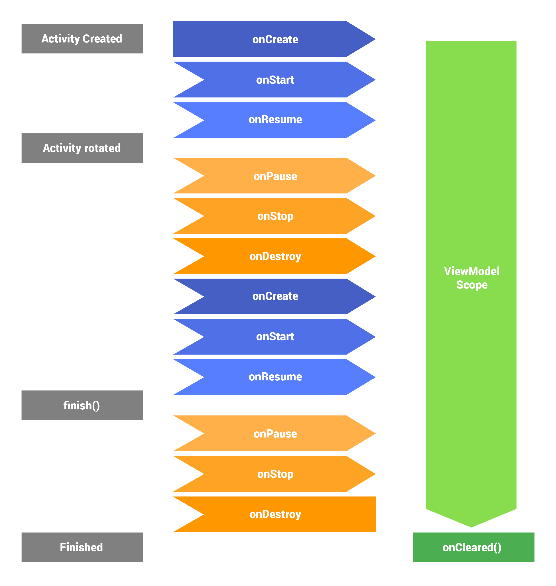

#### [<<<<<< Overview](1.Overview.md)

# ViewModel
ViewModel membantu UI controller menyiapkan data yang akan ditampilkan ke UI, dimana ViewModel akan selalu dipertahankan selama ada configuration changes.

Lifecycle ViewModel:

Dengan kemampuannya untuk mempertahankan data, terutama data besar, viewmodel dapat menggantikan peran savedInstanceState, berikut perbandingan antara keduanya:

| Pembeda                                                       | ViewModel    | savedInstanceState     |
| :---                                                          |    :----:    |          ---: |
| Lokasi penyimpanan                                            | Di memory    | Serialized ke dalam disk   |
| Mampu bertahan dari configuration change                      | Ya           | Ya      |
| Bertahan dari proses mematikan app yang dimulai dari sistem   | Tidak        | Ya      |
| Bertahan dari kesalahan aktifitas user atau onFinish()        | Tidak        | Tidak      |
| Keterbatasan Data                                             | Obyek kompleks akan baik baik saja, namun ruangnya dibatasi oleh memori yang tersedia        | Hanya untuk tipe primitif dan obyek kecil dan sederhana seperti String, Integer dll.      |
| Waktu Read/Write                                              | Cepat (Hanya mengakses memori)        | Lambat (Membutuhkan serialisasi / deserialisasi dan akses ke disk)      |

# Lifecycle
Lifecycle dapat menyimpan informasi mengenai state dari komponen Lifecycle seperti Activity atau Fragment dan memungkinkan sebuah obyek untuk melakukan observasi terhadap perubahan keadaan dari sebuah Lifecycle.

Lifecycle mempunyai dua komponen utama untuk melacak perubahan keadaan dari lifecycle, yaitu:
1. Event atau Peristiwa : Peristiwa dari Lifecycle yang dikirimkan dari sebuah Framework dan kelas Lifecycle. Event Lifecycle akan memetakan event callback atau balikan event dalam Activity atau Fragment.

2. State atau keadaan : Sebuah keadaan dari komponen yang dilacak dari obyek Lifecycle.

   

#### [CodeLab ViewModel](../CodeLab/1.ViewModel.md)

# Referensi
1. [ViewModel - developer android](https://developer.android.com/topic/libraries/architecture/viewmodel)
2. [Lifecycle - developer android](https://developer.android.com/topic/libraries/architecture/lifecycle)

#### [LiveData >>>>>>](3.LiveData.md)