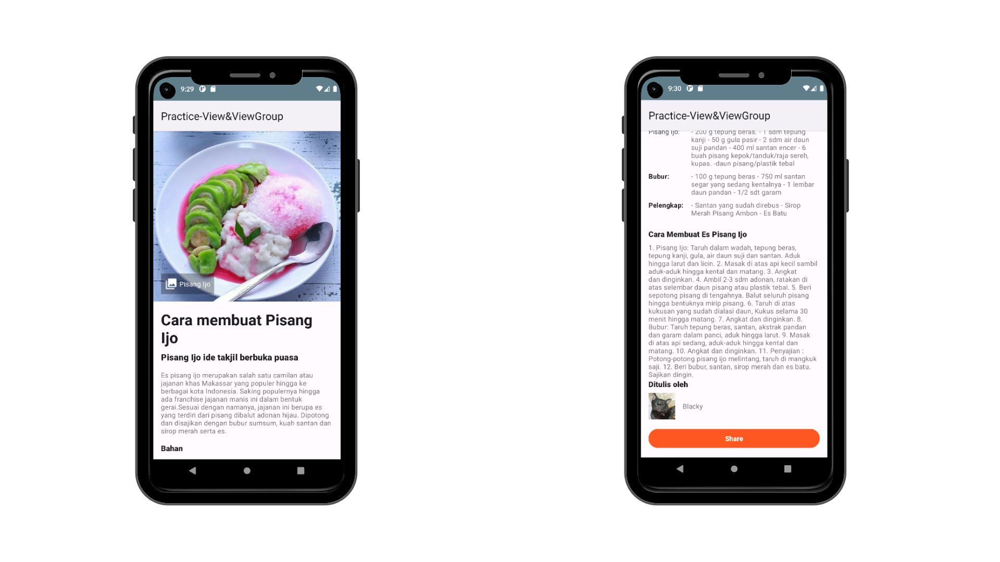

# STYLE AND THEME PRATICE

Pastikan bahwa kalian sudah menginstall Android Studio pada device kalian masing-masing yaa!

**1.** Kalian bisa **Running** Android Studio terlebih dahulu dan buka kembali proyek sebelumnya (PracticeViewViewGroup). Kemudian lihatlah kembali file *activity_main.xml* terlebih dahulu agar kalian familiar dengan komponen view yang ada di sana.

**2.** Karena pada praktek kali ini akan mengimplementasikan style dan theme, maka dimulai dengan mengubah warna bawaan dari aplikasi PracticeViewViewGroup. Buka file **colors.xml** di **res -> values -> colors.xml**. Dan ubah setiap nilai-nilai yang ada menjadi seperti di bawah.

```xml
<?xml version="1.0" encoding="utf-8"?>
<resources>
    <color name="black">#FF000000</color>
    <color name="white">#FFFFFFFF</color>
    <color name="gray">#607D8B</color>
    <color name="gray_light">#B0BEC5</color>
    <color name="gray_dark">#455A64</color>
    <color name="orange">#FF5722</color>
    <color name="orange_light">#FFAB91</color>
    <color name="orange_dark">#E64A19</color>
    <color name="colorSubtitle">#757575</color>
</resources>
```

**3.** Kemudian, sesuaikan warna-warna nya ke dalam theme aplikasi, pada berkas **themes.xml**. Buka **res -> values -> themes.xml** dan jangan lupa menghapus atribut **.NoActionBar** untuk menampilkan ActionBar default.

```xml
<resources xmlns:tools="http://schemas.android.com/tools">
    <!-- Base application theme. -->
    <style name="Base.Theme.MyViewAndViewGroup" parent="Theme.Material3.DayNight">
        <!-- Primary brand color. -->
        <item name="colorPrimary">@color/gray</item>
        <item name="colorOnPrimary">@color/white</item>
        <!-- Secondary brand color. -->
        <item name="colorSecondary">@color/orange_light</item>
        <item name="colorOnSecondary">@color/black</item>
    </style>
 
    <style name="Theme.MyViewAndViewGroup" parent="Base.Theme.MyViewAndViewGroup" />
</resources>
```
Pastikan Anda juga memperbarui kode dalam file **themes.xml (night)**.

```xml
<resources xmlns:tools="http://schemas.android.com/tools">
    <!-- Base application theme. -->
    <style name="Base.Theme.MyViewAndViewGroup" parent="Theme.Material3.DayNight">
        <!-- Primary brand color. -->
        <item name="colorPrimary">@color/gray_light</item>
        <item name="colorOnPrimary">@color/black</item>
        <!-- Secondary brand color. -->
        <item name="colorSecondary">@color/orange_light</item>
        <item name="colorOnSecondary">@color/black</item>
    </style>
 
    <style name="Theme.MyViewAndViewGroup" parent="Base.Theme.MyViewAndViewGroup" />
</resources>
```

**4.** Lalu buat sebuah style untuk setiap teks yang digunakan. Artinya hal ini dapat mempersingkat teks yang dibuat, buka berkas **themes.xml** lagi dan masukkan kode-kode di bawah.

```xml
<style name="TextContent">
        <item name="android:layout_width">wrap_content</item>
        <item name="android:layout_height">wrap_content</item>
    </style>
    <style name="TextContent.HeadlineMedium">
        <item name="android:layout_marginLeft">16dp</item>
        <item name="android:layout_marginRight">16dp</item>
        <item name="android:textAppearance">@style/TextAppearance.Material3.HeadlineMedium</item>
    </style>
    <style name="TextContent.HeadlineMedium.Bold">
        <item name="android:textStyle">bold</item>
    </style>
    <style name="TextContent.TitleMedium">
        <item name="android:textAppearance">@style/TextAppearance.Material3.TitleMedium</item>
    </style>
    <style name="TextContent.TitleMedium.Bold">
        <item name="android:textStyle">bold</item>
    </style>
    <style name="TextContent.TitleMedium.Bold.MarginLeftRight">
        <item name="android:layout_marginLeft">16dp</item>
        <item name="android:layout_marginRight">16dp</item>
    </style>
    <style name="TextContent.BodyMedium">
        <item name="android:textAppearance">@style/TextAppearance.Material3.BodyMedium</item>
    </style>
    <style name="TextContent.BodyMedium.Gray">
        <item name="android:textColor">@color/colorSubtitle</item>
    </style>
    <style name="TextContent.BodyMedium.Gray.MarginLeftRight">
        <item name="android:layout_marginLeft">16dp</item>
        <item name="android:layout_marginRight">16dp</item>
    </style>
    <style name="TextContent.BodyMedium.White">
        <item name="android:textColor">@android:color/white</item>
    </style>
    <style name="TextContent.BodyMedium.White.MarginAll">
        <item name="android:layout_marginLeft">16dp</item>
        <item name="android:layout_marginRight">16dp</item>
        <item name="android:layout_marginStart">16dp</item>
        <item name="android:layout_marginBottom">16dp</item>
    </style>
    <style name="TextContent.BodyMedium.Bold">
        <item name="android:textStyle">bold</item>
    </style>
 
    <style name="Theme.MyViewAndViewGroup" parent="Base.Theme.MyViewAndViewGroup" />
```
*Note:* pastikan kode di atas juga ditambahkan dalam file **themes.xml (night)**.

**5.** Jika sudah, kalian dapat mengimplementasikan beberapa *style* yang tadi sudah dibuat ke dalam file **activity_main.xml** dan akan menjadi seperti di bawah.

```xml
<?xml version="1.0" encoding="utf-8"?>
<ScrollView xmlns:android="http://schemas.android.com/apk/res/android"
    xmlns:app="http://schemas.android.com/apk/res-auto"
    android:layout_width="match_parent"
    android:layout_height="match_parent">

    <LinearLayout
        android:layout_width="match_parent"
        android:layout_height="wrap_content"
        android:orientation="vertical">

        <FrameLayout
            android:layout_width="match_parent"
            android:layout_height="wrap_content">
            <ImageView
                android:layout_width="match_parent"
                android:layout_height="wrap_content"
                android:adjustViewBounds="true"
                android:scaleType="fitXY"
                android:src="@drawable/pisang_ijo" />
            <TextView
                style="@style/TextContent.BodyMedium.White.MarginAll"
                android:layout_gravity="bottom"
                android:background="#4D000000"
                android:drawablePadding="4dp"
                android:gravity="center_vertical"
                android:padding="8dp"
                android:text="@string/pisang_ijo"
                app:drawableStartCompat="@drawable/ic_collections_white_18dp" />
        </FrameLayout>

        <TextView
            style="@style/TextContent.HeadlineMedium.Bold"
            android:layout_marginTop="16dp"
            android:layout_marginBottom="8dp"
            android:text="@string/menu"
            android:textSize="32sp" />
        <TextView
            style="@style/TextContent.TitleMedium.Bold.MarginLeftRight"
            android:layout_marginBottom="16dp"
            android:text="@string/title"
            android:textSize="18sp" />
        <TextView
            style="@style/TextContent.BodyMedium.Gray.MarginLeftRight"
            android:layout_marginBottom="16dp"
            android:lineSpacingMultiplier="1"
            android:text="@string/content_text" />

        <TextView
            style="@style/TextContent.TitleMedium.Bold.MarginLeftRight"
            android:layout_marginBottom="8dp"
            android:text="@string/ingredient" />

        <TableLayout
            android:layout_width="match_parent"
            android:layout_height="wrap_content"
            android:layout_marginLeft="16dp"
            android:layout_marginRight="16dp"
            android:layout_marginBottom="16dp">
            <TableRow
                android:layout_width="match_parent"
                android:layout_height="wrap_content"
                android:layout_marginBottom="8dp">
                <TextView
                    android:layout_width="wrap_content"
                    android:layout_height="wrap_content"
                    android:textSize="14sp"
                    android:layout_marginEnd="16dp"
                    android:text="@string/banana" />
                <TextView
                    style="@style/TextContent.BodyMedium.Gray"
                    android:layout_weight="1"
                    android:text="@string/ingredient_banana" />
            </TableRow>
            <TableRow
                android:layout_width="match_parent"
                android:layout_height="wrap_content"
                android:layout_marginBottom="8dp">
                <TextView
                    style="@style/TextContent.BodyMedium.Bold"
                    android:layout_marginEnd="16dp"
                    android:text="@string/pure" />
                <TextView
                    style="@style/TextContent.BodyMedium.Gray"
                    android:layout_weight="1"
                    android:text="@string/ingredient_pure" />
            </TableRow>
            <TableRow
                android:layout_width="match_parent"
                android:layout_height="wrap_content"
                android:layout_marginBottom="8dp">
                <TextView
                    style="@style/TextContent.BodyMedium.Bold"
                    android:layout_marginEnd="16dp"
                    android:text="@string/complement" />
                <TextView
                    style="@style/TextContent.BodyMedium.Gray"
                    android:layout_weight="1"
                    android:text="@string/ingredient_complement" />
            </TableRow>
        </TableLayout>

        <TextView
            style="@style/TextContent.TitleMedium.Bold.MarginLeftRight"
            android:layout_marginBottom="8dp"
            android:text="@string/how_to" />

        <TextView
            style="@style/TextContent.BodyMedium.Gray.MarginLeftRight"
            android:layout_weight="1"
            android:text="@string/content_specs_display" />

        <TextView
            style="@style/TextContent.TitleMedium.Bold.MarginLeftRight"
            android:layout_marginBottom="8dp"
            android:text="@string/writer" />

        <RelativeLayout
            android:layout_width="match_parent"
            android:layout_height="wrap_content"
            android:layout_marginLeft="16dp"
            android:layout_marginRight="16dp"
            android:layout_marginBottom="16dp">
            <ImageView
                android:id="@+id/profile_image"
                android:layout_width="56dp"
                android:layout_height="56dp"
                android:layout_centerVertical="true"
                android:layout_marginEnd="16dp"
                android:src="@drawable/bleki" />
            <TextView
                style="@style/TextContent.BodyMedium.Gray"
                android:layout_centerVertical="true"
                android:layout_toEndOf="@+id/profile_image"
                android:text="@string/my_name" />
        </RelativeLayout>

        <Button
            android:layout_width="match_parent"
            android:layout_height="wrap_content"
            android:layout_marginLeft="16dp"
            android:layout_marginRight="16dp"
            android:layout_marginBottom="16dp"
            android:text="@string/share" />

    </LinearLayout>
</ScrollView>
```
Dapat dilihat lagi bahwa setiap objek **TextView** menjadi lebih ringkas dan sederhana. Sebelum ke step selanjutnya kalian dapat menjalankan aplikasi.

**6.** Dan terakhir karena tombol *button* masih berada pada kondisi default nya, ini dikarenakan *Buutton* tersebut mengikuti MAterial Design 3 dengan warna bawaan dari theme, yaitu abu-abu. Maka, perlu ditambahkan style nya, di dalam file **themes.xml**. 
```xml
<style name="ButtonGeneral">
        <item name="android:layout_width">match_parent</item>
        <item name="android:layout_height">wrap_content</item>
        <item name="android:layout_marginRight">16dp</item>
        <item name="android:layout_marginLeft">16dp</item>
        <item name="android:layout_marginBottom">16dp</item>
    </style>
    <style name="ButtonGeneral.SecondaryVariant">
        <item name="android:backgroundTint">@color/orange</item>
        <item name="android:textColor">@color/white</item>
        <item name="android:textStyle">bold</item>
    </style>
```
*Note:* pastikan kode di atas juga ditambahkan dalam file **themes.xml (night)**.

**7.** Dan jangan lupa juga untuk mengimplementasikan nya pada file **activity_main.xml** dibagian objek button.
```xml
<Button
            style="@style/ButtonGeneral.SecondaryVariant"
            android:text="@string/share" />
```

**8**. Jangan lupa untuk menjalanlan aplikasi dan untuk menguji perubahan theme dan style silahkan mengubah tema menjadi *night themes* pada emulator android kalian.




