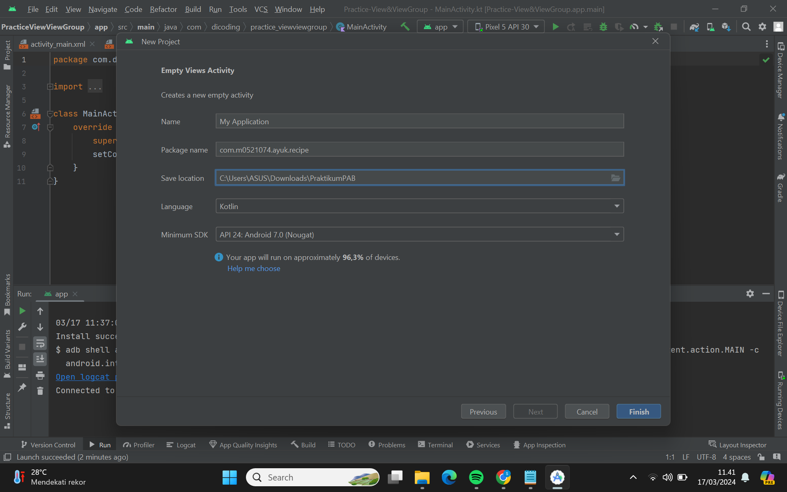
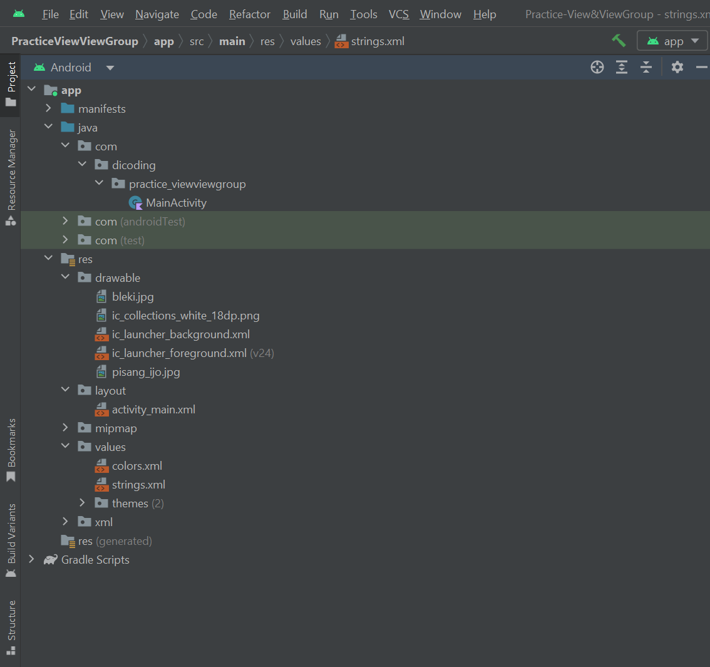
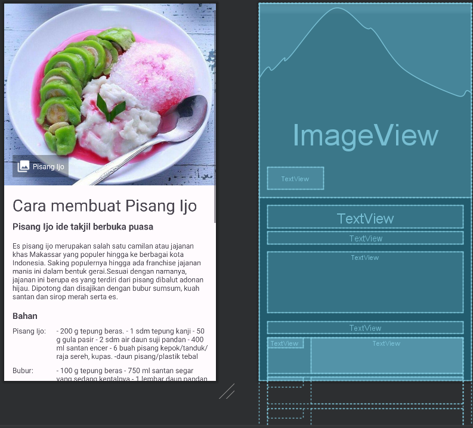

# View & ViewGroup PRACTICE

Pastikan bahwa kalian sudah menginstall Android Studio pada device kalian masing-masing yaa!

1. Kalian bisa **Running** Android Studio terlebih dahulu, maka akan menampilkan tampilan kurang lebih seperti ini. Kemudian, kalian bisa pilih **New Project**.

  

2. Kemudian, ditampilkan seperti di bawah ini. Dikarenkakan kita hanya membuat **basic project** saja maka kalian bisa memilih yang **Empty View Activity**. Kemudian, bisa klik **Next**.

  

3. Maka, akan ditampilkan window seperti berikut ini. Untuk **nama**, **Language**, **Minimum SDK**, dan **Build configuration language** bisa mengikuti seperti pada gambar, sedangkan untuk package bisa disesuaikan dengan format berikut ini: 

    **com.nim.2namapertama.beamvolume**.

4. Kemudian, untuk save location bisa disesuaikan sesuai dengan path pada device masing-masing. Lalu bisa pilih **Finish**.

    

5. Jika kalian sudah menkonfigurasi emulator, maka bisa langsung di-running dan akan tiba di MainActivity.


## Menyusun Tampilan dengan XML (Layouting)

1. Buka file **strings.xml** pada directory **res/values**. Sesuaikan isi nya dengan seperti berikut.

```xml
<resources>
    <string name="app_name">Practice-View&amp;ViewGroup</string>
    <string name="pisang_ijo">Pisang Ijo</string>
    <string name="content_text">Es pisang ijo merupakan salah satu camilan atau jajanan khas Makassar yang populer hingga ke berbagai kota Indonesia. Saking populernya hingga ada franchise jajanan manis ini dalam bentuk gerai.Sesuai dengan namanya, jajanan ini berupa es yang terdiri dari pisang dibalut adonan hijau. Dipotong dan disajikan dengan bubur sumsum, kuah santan dan sirop merah serta es.</string>
    <string name="content_specs_display">
        1. Pisang Ijo: Taruh dalam wadah, tepung beras,
        tepung kanji, gula, air daun suji dan santan. Aduk
        hingga larut dan licin.
        2. Masak di atas api kecil sambil aduk-aduk hingga
        kental dan matang.
        3. Angkat dan dinginkan.
        4. Ambil 2-3 sdm adonan, ratakan di atas selembar
        daun pisang atau plastik tebal.
        5. Beri sepotong pisang di tengahnya. Balut seluruh
        pisang hingga bentuknya mirip pisang.
        6. Taruh di atas kukusan yang sudah dialasi daun,
        Kukus selama 30 menit hingga matang.
        7. Angkat dan dinginkan.
        8. Bubur: Taruh tepung beras, santan, akstrak
        pandan dan garam dalam panci, aduk hingga larut.
        9. Masak di atas api sedang, aduk-aduk hingga
        kental dan matang.
        10. Angkat dan dinginkan.
        11. Penyajian : Potong-potong pisang ijo
        melintang, taruh di mangkuk saji.
        12. Beri bubur, santan, sirop merah dan es batu.
        Sajikan dingin.
    </string>
    <string name="title">Pisang Ijo ide takjil berbuka puasa</string>
    <string name="menu">Cara membuat Pisang Ijo</string>
    <string name="writer">Ditulis oleh</string>
    <string name="my_name">Blacky</string>
    <string name="share">Share</string>
    <string name="how_to"> Cara Membuat Es Pisang Ijo</string>
    <string name="ingredient"> Bahan</string>
    <string name="banana" >Pisang Ijo:</string>
    <string name="ingredient_banana">
        - 200 g tepung beras.
        - 1 sdm tepung kanji
        - 50 g gula pasir
        - 2 sdm air daun suji pandan
        - 400 ml santan encer
        - 6 buah pisang kepok/tanduk/raja sereh,
        kupas.
        -daun pisang/plastik tebal
    </string>
    <string name="pure" >Bubur:</string>

    <string name="ingredient_pure">
        - 100 g tepung beras
        - 750 ml santan segar yang
        sedang kentalnya
        - 1 lembar daun pandan
        - 1/2 sdt garam
    </string>
    <string name="complement">Pelengkap:</string>
    
    <string name="ingredient_complement" >
        - Santan yang sudah direbus
        - Sirop Merah Pisang Ambon
        - Es Batu
    </string>
</resources>
```
Kode diatas adalah variabel-variabel konstan berupa String yang ditulis agar teks yang sama tidak ditulis dua kali (di file **activity** dan **.xml**) dan juga agar menghindari warning karena dituliskan secara **hard code**, karena itu tidak direkomendasikan.

##

2. Berikutnya, unduh asset-nya di bawah ini.

   [alt text](assets/assets_view&viewgroup.zip)

Lalu, ekstrak berkas tersebut dan salin semua asset yang dibutuhkan ke dalam direktori **res → drawable**. Pilih folder drawable untuk mendukung semua versi Android.



*note:*
Penamaan file dalam resource drawable harus selalu menggunakan **huruf kecil** dan **underscore** saja.

##

3. Buka berkas **activity_main.xml** dan ubah layout utama menjadi seperti ini.

```xml
<?xml version="1.0" encoding="utf-8"?>
<ScrollView xmlns:android="http://schemas.android.com/apk/res/android"
    android:layout_width="match_parent"
    android:layout_height="match_parent">
   
</ScrollView>
```
View dan viewgroup memiliki dua buah atribut penting yang harus selalu diberikan nilai untuk mengatur posisi di dalam sebuah layout, yaitu; **layout_width** dan **layout_height**. Dan **Scrollview** disini sebagai *root* agar halaman aplikasi dapat digulir ke bawah dan ke atas.

##

4. Kemudian tambahkan layout utama di dalam **ScrollView**.

```xml
<?xml version="1.0" encoding="utf-8"?>
<ScrollView xmlns:android="http://schemas.android.com/apk/res/android"
    android:layout_width="match_parent"
    android:layout_height="match_parent">
 
    <LinearLayout
        android:layout_width="match_parent"
        android:layout_height="wrap_content"
        android:orientation="vertical">
        
    </LinearLayout>
</ScrollView>
```
Karena **ScrollView** hanya diperbolehkan 1 *parent* saja maka, pada kode diatas **ScrollView** hanya memiliki satu layout viewgroup sebagai root.

##

5. Kemudian masukkan komponen di dalam **LinearLayout** yang sudah ditambahkan sebelumnya.

```xml
<FrameLayout
            android:layout_width="match_parent"
            android:layout_height="wrap_content">
            <ImageView
                android:layout_width="match_parent"
                android:layout_height="wrap_content"
                android:adjustViewBounds="true"
                android:scaleType="fitXY"
                android:src="@drawable/pisang_ijo" />
            <TextView
                android:layout_width="wrap_content"
                android:layout_height="wrap_content"
                android:textColor="@android:color/white"
                android:layout_gravity="bottom"
                android:layout_marginStart="16dp"
                android:layout_marginBottom="16dp"
                android:background="#4D000000"
                android:drawablePadding="4dp"
                android:gravity="center_vertical"
                android:padding="8dp"
                android:text="@string/pisang_ijo"
                android:drawableStart="@drawable/ic_collections_white_18dp" />
        </FrameLayout>
```
Sesuai dengan sifat **frameLayout** yang dapat membuat komponen yang ada di dalamnya menjadi menumpuk atau saling menutupi satu dengan yang lainnya, sehingga gambar **pisang_ijo** akan menjadi tumpukan abgi obyek **text_view** yang berada diatas nya.

##

6. Kemudian, tambahkan **TextView** di bawah **FrameLayout**.  

```xml
<TextView
            android:layout_width="match_parent"
            android:layout_height="wrap_content"
            android:layout_marginLeft="16dp"
            android:layout_marginRight="16dp"
            android:layout_marginTop="16dp"
            android:layout_marginBottom="8dp"
            android:text="@string/menu"
            android:textSize="32sp" />
        <TextView
            android:layout_width="match_parent"
            android:layout_height="wrap_content"
            android:layout_marginLeft="16dp"
            android:layout_marginRight="16dp"
            android:layout_marginBottom="16dp"
            android:text="@string/title"
            android:textSize="18sp"
            android:textStyle="bold" />
        <TextView
            android:layout_width="match_parent"
            android:layout_height="wrap_content"
            android:layout_marginLeft="16dp"
            android:layout_marginRight="16dp"
            android:layout_marginBottom="16dp"
            android:lineSpacingMultiplier="1"
            android:text="@string/content_text" />
```

##

7. Setelah menambahkan beberapa **TextView**, selanjutnya kita akan menambahkan **TableLayout**.

```xml
<TextView
            android:layout_width="match_parent"
            android:layout_height="wrap_content"
            android:textSize="17sp"
            android:layout_marginLeft="16dp"
            android:layout_marginRight="16dp"
            android:layout_marginBottom="8dp"
            android:textStyle="bold"
            android:text="@string/ingredient" />

        <TableLayout
            android:layout_width="match_parent"
            android:layout_height="wrap_content"
            android:layout_marginLeft="16dp"
            android:layout_marginRight="16dp"
            android:layout_marginBottom="16dp">
            <TableRow
                android:layout_width="match_parent"
                android:layout_height="wrap_content"
                android:layout_marginBottom="8dp">
                <TextView
                    android:layout_width="wrap_content"
                    android:layout_height="wrap_content"
                    android:textSize="14sp"
                    android:layout_marginEnd="16dp"
                    android:text="@string/banana" />
                <TextView
                    android:layout_width="match_parent"
                    android:layout_height="wrap_content"
                    android:textSize="14sp"
                    android:layout_weight="1"
                    android:text="@string/ingredient_banana" />
            </TableRow>
            <TableRow
                android:layout_width="match_parent"
                android:layout_height="wrap_content"
                android:layout_marginBottom="8dp">
                <TextView
                    android:layout_width="wrap_content"
                    android:layout_height="wrap_content"
                    android:layout_marginEnd="16dp"
                    android:textSize="14sp"
                    android:text="@string/pure" />
                <TextView
                    android:layout_width="match_parent"
                    android:layout_height="wrap_content"
                    android:layout_weight="1"
                    android:textSize="14sp"
                    android:text="@string/ingredient_pure" />
            </TableRow>
            <TableRow
                android:layout_width="match_parent"
                android:layout_height="wrap_content"
                android:layout_marginBottom="8dp">
                <TextView
                    android:layout_width="wrap_content"
                    android:layout_height="wrap_content"
                    android:layout_marginEnd="16dp"
                    android:textSize="14sp"
                    android:text="@string/complement" />
                <TextView
                    android:layout_width="match_parent"
                    android:layout_height="wrap_content"
                    android:layout_weight="1"
                    android:textSize="14sp"
                    android:text="@string/ingredient_complement" />
            </TableRow>
        </TableLayout>
```
**TableLayout** yang digunakan hanya agar menampilkan informasi lebih dan juga menggunakan **TableRow** untuk menambahkan sebuah baris baru di dalam sebuah **TableLayout**.

##

8. Kemudian tambahkan beberapa **TextView** lagi.
```xml
<TextView
            android:layout_width="match_parent"
            android:layout_height="wrap_content"
            android:textSize="15sp"
            android:layout_marginLeft="16dp"
            android:layout_marginRight="16dp"
            android:layout_marginBottom="8dp"
            android:text="@string/how_to"
            android:textStyle="bold"/>

        <TextView
            android:layout_width="match_parent"
            android:layout_height="wrap_content"
            android:layout_marginLeft="16dp"
            android:layout_marginRight="16dp"
            android:layout_marginBottom="16dp"
            android:textSize="14sp"
            android:text="@string/content_specs_display" />

```

##

9. Kemudian setelah menambahkan **TableLayout**, kita masukkan ViewGroup lagi. Tambahkan **RelativeLayout** dan **Button** di bawah **TableLayout** menjadi seperti ini.

```xml
<TextView
            android:layout_width="match_parent"
            android:layout_height="wrap_content"
            android:textSize="12sp"
            android:layout_marginLeft="16dp"
            android:layout_marginRight="16dp"
            android:layout_marginBottom="8dp"
            android:text="@string/writer" />

        <RelativeLayout
            android:layout_width="match_parent"
            android:layout_height="wrap_content"
            android:layout_marginLeft="16dp"
            android:layout_marginRight="16dp"
            android:layout_marginBottom="16dp">
            <ImageView
                android:id="@+id/profile_image"
                android:layout_width="56dp"
                android:layout_height="56dp"
                android:layout_centerVertical="true"
                android:layout_marginEnd="16dp"
                android:src="@drawable/bleki" />
            <TextView
                android:layout_width="match_parent"
                android:layout_height="wrap_content"
                android:layout_centerVertical="true"
                android:layout_toEndOf="@+id/profile_image"
                android:text="@string/my_name" />
        </RelativeLayout>

        <Button
            android:text="@string/share"
            android:layout_width="match_parent"
            android:layout_height="wrap_content"
            android:layout_marginLeft="16dp"
            android:layout_marginRight="16dp"
            android:layout_marginBottom="16dp" />
```
Sesuai dengan sifat **RelativeLayout** yang fleksibel sehingga kode diatas posisi teks mengacu ke sebelah kanan dari gambar dan posisi keduanya disesuaikan untuk berada secara vertikal.

##
10. Seperti inilah hasil akhir kode pada **activity_main.xml**

```xml
<?xml version="1.0" encoding="utf-8"?>
<ScrollView xmlns:android="http://schemas.android.com/apk/res/android"
    android:layout_width="match_parent"
    android:layout_height="match_parent">

    <LinearLayout
        android:layout_width="match_parent"
        android:layout_height="wrap_content"
        android:orientation="vertical">

        <FrameLayout
            android:layout_width="match_parent"
            android:layout_height="wrap_content">
            <ImageView
                android:layout_width="match_parent"
                android:layout_height="wrap_content"
                android:adjustViewBounds="true"
                android:scaleType="fitXY"
                android:src="@drawable/pisang_ijo" />
            <TextView
                android:layout_width="wrap_content"
                android:layout_height="wrap_content"
                android:textColor="@android:color/white"
                android:layout_gravity="bottom"
                android:layout_marginStart="16dp"
                android:layout_marginBottom="16dp"
                android:background="#4D000000"
                android:drawablePadding="4dp"
                android:gravity="center_vertical"
                android:padding="8dp"
                android:text="@string/pisang_ijo"
                android:drawableStart="@drawable/ic_collections_white_18dp" />
        </FrameLayout>

        <TextView
            android:layout_width="match_parent"
            android:layout_height="wrap_content"
            android:layout_marginLeft="16dp"
            android:layout_marginRight="16dp"
            android:layout_marginTop="16dp"
            android:layout_marginBottom="8dp"
            android:text="@string/menu"
            android:textSize="32sp" />
        <TextView
            android:layout_width="match_parent"
            android:layout_height="wrap_content"
            android:layout_marginLeft="16dp"
            android:layout_marginRight="16dp"
            android:layout_marginBottom="16dp"
            android:text="@string/title"
            android:textSize="18sp"
            android:textStyle="bold" />
        <TextView
            android:layout_width="match_parent"
            android:layout_height="wrap_content"
            android:layout_marginLeft="16dp"
            android:layout_marginRight="16dp"
            android:layout_marginBottom="16dp"
            android:lineSpacingMultiplier="1"
            android:text="@string/content_text" />

        <TextView
            android:layout_width="match_parent"
            android:layout_height="wrap_content"
            android:textSize="17sp"
            android:layout_marginLeft="16dp"
            android:layout_marginRight="16dp"
            android:layout_marginBottom="8dp"
            android:textStyle="bold"
            android:text="@string/ingredient" />

        <TableLayout
            android:layout_width="match_parent"
            android:layout_height="wrap_content"
            android:layout_marginLeft="16dp"
            android:layout_marginRight="16dp"
            android:layout_marginBottom="16dp">
            <TableRow
                android:layout_width="match_parent"
                android:layout_height="wrap_content"
                android:layout_marginBottom="8dp">
                <TextView
                    android:layout_width="wrap_content"
                    android:layout_height="wrap_content"
                    android:textSize="14sp"
                    android:layout_marginEnd="16dp"
                    android:text="@string/banana" />
                <TextView
                    android:layout_width="match_parent"
                    android:layout_height="wrap_content"
                    android:textSize="14sp"
                    android:layout_weight="1"
                    android:text="@string/ingredient_banana" />
            </TableRow>
            <TableRow
                android:layout_width="match_parent"
                android:layout_height="wrap_content"
                android:layout_marginBottom="8dp">
                <TextView
                    android:layout_width="wrap_content"
                    android:layout_height="wrap_content"
                    android:layout_marginEnd="16dp"
                    android:textSize="14sp"
                    android:text="@string/pure" />
                <TextView
                    android:layout_width="match_parent"
                    android:layout_height="wrap_content"
                    android:layout_weight="1"
                    android:textSize="14sp"
                    android:text="@string/ingredient_pure" />
            </TableRow>
            <TableRow
                android:layout_width="match_parent"
                android:layout_height="wrap_content"
                android:layout_marginBottom="8dp">
                <TextView
                    android:layout_width="wrap_content"
                    android:layout_height="wrap_content"
                    android:layout_marginEnd="16dp"
                    android:textSize="14sp"
                    android:text="@string/complement" />
                <TextView
                    android:layout_width="match_parent"
                    android:layout_height="wrap_content"
                    android:layout_weight="1"
                    android:textSize="14sp"
                    android:text="@string/ingredient_complement" />
            </TableRow>
        </TableLayout>

        <TextView
            android:layout_width="match_parent"
            android:layout_height="wrap_content"
            android:textSize="15sp"
            android:layout_marginLeft="16dp"
            android:layout_marginRight="16dp"
            android:layout_marginBottom="8dp"
            android:text="@string/how_to"
            android:textStyle="bold"/>

        <TextView
            android:layout_width="match_parent"
            android:layout_height="wrap_content"
            android:layout_marginLeft="16dp"
            android:layout_marginRight="16dp"
            android:layout_marginBottom="16dp"
            android:textSize="14sp"
            android:text="@string/content_specs_display" />

        <TextView
            android:layout_width="match_parent"
            android:layout_height="wrap_content"
            android:textSize="12sp"
            android:layout_marginLeft="16dp"
            android:layout_marginRight="16dp"
            android:layout_marginBottom="8dp"
            android:text="@string/writer" />

        <RelativeLayout
            android:layout_width="match_parent"
            android:layout_height="wrap_content"
            android:layout_marginLeft="16dp"
            android:layout_marginRight="16dp"
            android:layout_marginBottom="16dp">
            <ImageView
                android:id="@+id/profile_image"
                android:layout_width="56dp"
                android:layout_height="56dp"
                android:layout_centerVertical="true"
                android:layout_marginEnd="16dp"
                android:src="@drawable/bleki" />
            <TextView
                android:layout_width="match_parent"
                android:layout_height="wrap_content"
                android:layout_centerVertical="true"
                android:layout_toEndOf="@+id/profile_image"
                android:text="@string/my_name" />
        </RelativeLayout>

        <Button
            android:text="@string/share"
            android:layout_width="match_parent"
            android:layout_height="wrap_content"
            android:layout_marginLeft="16dp"
            android:layout_marginRight="16dp"
            android:layout_marginBottom="16dp" />

    </LinearLayout>
</ScrollView>
```

**Tampilan akhir dari latihan ini**



*Apabila berhasil, maka aplikasi dapat digulir ke bawah dan ke atas.*

##

Anda dapat mengunjungi tautan berikut untuk berbagai contoh UI yang menarik pada Android.

-    [Resource UI dari Uplabs](https://www.uplabs.com/)
-    [Mobile design inspiration from Dribbble ](https://dribbble.com/tags/mobile)
