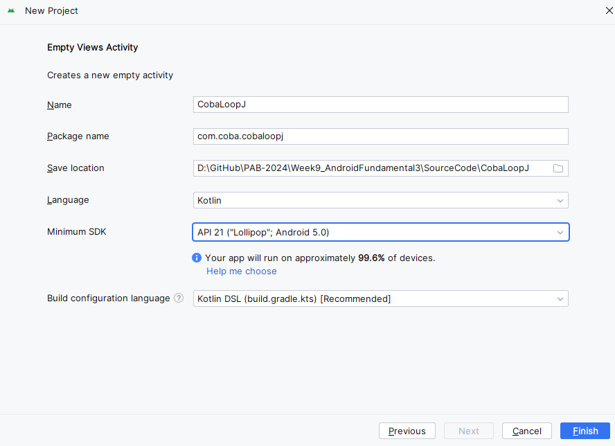
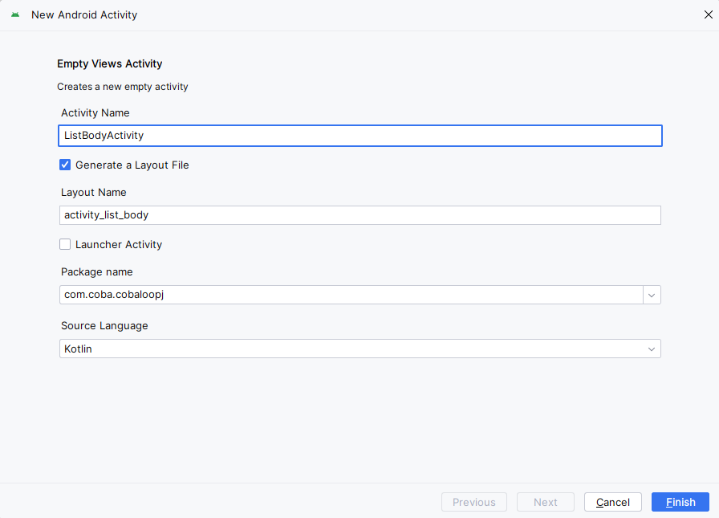

# CodeLab Networking dengan LoopJ

1. Buatlah project baru di android studio, dengan ketentuan seperti gambar berikut ini:
   
   Bisa diganti, jika ada yang perlu diganti.

2. API yang akan digunakan, yaitu:

   - https://jsonplaceholder.typicode.com/posts/1
   - https://jsonplaceholder.typicode.com/posts

3. Buka url dummy public API di atas pada browser, install ekstensi JSON Formatter pada browser agar lebih mudah untuk dibaca.

4. Tambahkan kode di bawah ini, yang merupakan library AsyncHttpClient (LoopJ), pada **build.gradle.kts(Module: app)**, lalu pilih **sync now** tunggu sampai proses sinkronisasi gradle selesai.

   ```
   dependencies {
       ...
       implementation("com.loopj.android:android-async-http:1.4.11")
   }
   ```

5. Buat desain aplikasi pada layout activity_main.xml seperti berikut:

   ```
   <?xml version="1.0" encoding="utf-8"?>
   <androidx.constraintlayout.widget.ConstraintLayout xmlns:android="http://schemas.android.com/apk/res/android"
   xmlns:app="http://schemas.android.com/apk/res-auto"
   xmlns:tools="http://schemas.android.com/tools"
   android:id="@+id/activity_main"
   android:layout_width="match_parent"
   android:layout_height="match_parent"
   android:padding="16dp"
   android:orientation="vertical"
   tools:context="MainActivity">

   <TextView
       android:id="@+id/tvBody"
       android:layout_width="match_parent"
       android:layout_height="wrap_content"
       android:layout_margin="16dp"
       android:textAlignment="center"
       android:textSize="18sp"
       android:textStyle="bold"
       app:layout_constraintBottom_toBottomOf="parent"
       app:layout_constraintEnd_toEndOf="parent"
       app:layout_constraintStart_toStartOf="parent"
       app:layout_constraintTop_toTopOf="parent"
       tools:text="@string/body" />

   <TextView
       android:id="@+id/tvTitle"
       android:layout_width="match_parent"
       android:layout_height="wrap_content"
       android:layout_margin="16dp"
       android:textAlignment="center"
       android:textSize="14sp"
       android:textStyle="italic"
       app:layout_constraintTop_toBottomOf="@+id/tvBody"
       tools:layout_editor_absoluteX="16dp"
       tools:text="@string/title" />

   <ProgressBar
       android:id="@+id/progressBar"
       style="?android:attr/progressBarStyle"
       android:layout_width="wrap_content"
       android:layout_height="wrap_content"
       app:layout_constraintBottom_toBottomOf="parent"
       app:layout_constraintEnd_toEndOf="parent"
       app:layout_constraintStart_toStartOf="parent"
       app:layout_constraintTop_toTopOf="parent" />

   <Button
       android:id="@+id/btnAllBody"
       android:layout_width="wrap_content"
       android:layout_height="wrap_content"
       android:layout_margin="16dp"
       android:text="@string/show_list_body"
       app:layout_constraintBottom_toBottomOf="parent"
       app:layout_constraintEnd_toEndOf="parent"
       app:layout_constraintStart_toStartOf="parent" />

   </androidx.constraintlayout.widget.ConstraintLayout>
   ```

   Tambahkan juga resource di strings.xml seperti berikut:

   ```
   <resources>
       <string name="app_name">CobaLoopJ</string>
       <string name="body">Body</string>
       <string name="title">- Title</string>
       <string name="show_list_body">Show list of body</string>
   </resources>
   ```

6. Tambahkan kode berikut pada MainActivity

   ```
   class MainActivity : AppCompatActivity() {

       companion object {
           private val TAG = MainActivity::class.java.simpleName
       }
       private lateinit var binding: ActivityMainBinding

       override fun onCreate(savedInstanceState: Bundle?) {
           super.onCreate(savedInstanceState)
           binding = ActivityMainBinding.inflate(layoutInflater)
           setContentView(binding.root)
           getRandomBody()
       }

       private fun getRandomBody() {

       }
   }
   ```

    Penjelasan beberapa kode di atas sebagai berikut:
    1. Companion Object: Digunakan untuk mendefinisikan properti TAG yang merupakan nama kelas MainActivity dalam bentuk string. TAG sering digunakan untuk logging.
    2. Binding: Variabel binding digunakan untuk mengikat layout XML activity_main.xml ke dalam kelas MainActivity. Ini memungkinkan Anda mengakses elemen UI yang ada di layout tersebut.
    3. onCreate(): Metode ini dipanggil ketika aktivitas dibuat. Di dalamnya, layout activity_main.xml dihubungkan dengan aktivitas menggunakan binding, dan getRandomBody() dipanggil.
    4. getRandomBody(): Metode ini belum diimplementasikan. Nantinya, metode ini dapat digunakan untuk mengambil konten acak dari suatu sumber data, seperti API, dan menampilkannya di UI.
   
    Aktifkan juga ViewBinding pada **build.gradle(module: app)**, dengan menambahkan kode berikut:

   ```
   android {
       ...
       buildFeatures {
           viewBinding = true
       }
   }
   ```

   Kode tersebut adalah bagian dari konfigurasi build.gradle (Module: app) dalam proyek Android. Bagian ini mengaktifkan fitur View Binding, yang memungkinkan untuk mengikat elemen UI dalam layout XML ke dalam kelas Kotlin secara langsung, tanpa perlu menggunakan findViewById(). Dengan mengaktifkan fitur ini, dapat mengakses elemen UI dengan lebih aman dan efisien dalam kode Anda.  

7. Implementasikan LoopJ untuk mengambil data dari Web API dengan menambahkan kode berikut pada MainActivity seperti berikut:

   ```
   private fun getRandomBody() {
       binding.progressBar.visibility = View.VISIBLE
       val client = AsyncHttpClient()
       val url = "https://jsonplaceholder.typicode.com/posts/1"
       client.get(url, object : AsyncHttpResponseHandler() {
           override fun onSuccess(statusCode: Int, headers: Array<Header>, responseBody: ByteArray) {
               // Jika koneksi berhasil
           }
           override fun onFailure(statusCode: Int, headers: Array<Header>, responseBody: ByteArray, error: Throwable) {
               // Jika koneksi gagal
           }
       })
   }
   ```

   Penjelasan beberapa kode di atas sebagai berikut:
   1. binding.progressBar.visibility = View.VISIBLE digunakan untuk menampilkan progress bar saat sedang melakukan pengambilan data.
    2. val client = AsyncHttpClient() digunakan untuk membuat instance dari AsyncHttpClient, kelas yang disediakan oleh LoopJ untuk melakukan permintaan HTTP.
    3. val url = "https://jsonplaceholder.typicode.com/posts/1" adalah URL dari Web API yang akan diambil datanya.
    4. client.get(url, object : AsyncHttpResponseHandler() { ... }) digunakan untuk melakukan permintaan GET ke URL yang telah ditentukan. Callback object : AsyncHttpResponseHandler() digunakan untuk menangani respons dari permintaan tersebut.
    5. onSuccess akan dipanggil jika permintaan berhasil, sedangkan onFailure akan dipanggil jika permintaan gagal.

8. Perhatikan JSON dari url dummy API poin 7:

   ```
   {
       "userId": 1,
       "id": 1,
       "title": "sunt aut facere repellat provident occaecati excepturi optio reprehenderit",
       "body": "quia et suscipit\nsuscipit recusandae consequuntur expedita et cum\nreprehenderit molestiae ut ut quas totam\nnostrum rerum est autem sunt rem eveniet architecto"
   }
   ```

   Terdapat 1 JSON Object, pada kasus ini diperlukan data dengan key "body" dan "title". Untuk itu, akan dilakukan parsing JSON data tersebut dengan menggunakan kode berikut pada method onSuccess dan onFailure di MainActivity:

   ```
   private fun getRandomBody() {
       binding.progressBar.visibility = View.VISIBLE
       val client = AsyncHttpClient()
       val url = "https://jsonplaceholder.typicode.com/posts/1"
       client.get(url, object : AsyncHttpResponseHandler() {
           override fun onSuccess(statusCode: Int, headers: Array<Header>, responseBody: ByteArray) {
               // Jika koneksi berhasil
               binding.progressBar.visibility = View.INVISIBLE
               val result = String(responseBody)
               Log.d(TAG, result)
               try {
                   val responseObject = JSONObject(result)
                   val body = responseObject.getString("body")
                   val title = responseObject.getString("title")
                   binding.tvBody.text = body
                   binding.tvTitle.text = title
               } catch (e: Exception) {
                   Toast.makeText(this@MainActivity, e.message, Toast.LENGTH_SHORT).show()
                   e.printStackTrace()
               }
           }
           override fun onFailure(statusCode: Int, headers: Array<Header>, responseBody: ByteArray, error: Throwable) {
               // Jika koneksi gagal
               binding.progressBar.visibility = View.INVISIBLE
               val errorMessage = when (statusCode) {
                   401 -> "$statusCode : Bad Request"
                   403 -> "$statusCode : Forbidden"
                   404 -> "$statusCode : Not Found"
                   else -> "$statusCode : ${error.message}"
               }
               Toast.makeText(this@MainActivity, errorMessage, Toast.LENGTH_SHORT).show()
           }
       })
   }
   ```

   Penjelasan beberapa kode di atas adalah sebagai berikut:
   1. binding.progressBar.visibility = View.INVISIBLE digunakan untuk menyembunyikan progress bar setelah proses pengambilan data selesai.
    2. val result = String(responseBody) mengubah array byte respons menjadi string.
    3. JSONObject(result) digunakan untuk membuat objek JSON dari string respons.
    4. responseObject.getString("body") dan responseObject.getString("title") digunakan untuk mendapatkan nilai dari atribut "body" dan "title" dalam respons JSON, kemudian menampilkannya pada komponen TextView di layout.
    5. Pada blok onFailure, progress bar juga disembunyikan dan pesan kesalahan yang sesuai dengan kode status HTTP diterima ditampilkan dalam sebuah Toast.

9. Karena dalam mengambil data melalui Web API ini memerlukan internet, maka tambahkan kode permission berikut pada AndroidManifest seperti berikut:

   ```
   <?xml version="1.0" encoding="utf-8"?>
   <manifest xmlns:android="http://schemas.android.com/apk/res/android"
       xmlns:tools="http://schemas.android.com/tools"

       <uses-permission android:name="android.permission.INTERNET" />

       <application
           ...
       </application>
   </manifest>
   ```

10. Jalankan aplikasi maka akan terlihat seperti ini:

    

11. Buatlah Activity baru dengan cara klik kanan pada nama **package → New → Activity → Empty Views Activity**. Kemudian beri nama ListBodyActivity
    

12. Buka activity_list_body.xml, kemudian tambahkan RecyclerView dan ProgressBar di dalamnya seperti ini:

    ```
    <?xml version="1.0" encoding="utf-8"?>
    <androidx.constraintlayout.widget.ConstraintLayout xmlns:android="http://schemas.android.com/apk/res/android"
        xmlns:app="http://schemas.android.com/apk/res-auto"
        xmlns:tools="http://schemas.android.com/tools"
        android:layout_width="match_parent"
        android:layout_height="match_parent"
        tools:context=".ListBodyActivity">

        <androidx.recyclerview.widget.RecyclerView
            android:id="@+id/listBody"
            android:layout_width="match_parent"
            android:layout_height="match_parent"
            app:layout_constraintBottom_toTopOf="parent"
            app:layout_constraintEnd_toEndOf="parent"
            app:layout_constraintStart_toStartOf="parent"
            app:layout_constraintTop_toTopOf="parent" />
        <ProgressBar
            android:id="@+id/progressBar"
            style="?android:attr/progressBarStyle"
            android:layout_width="wrap_content"
            android:layout_height="wrap_content"
            app:layout_constraintBottom_toBottomOf="parent"
            app:layout_constraintEnd_toEndOf="parent"
            app:layout_constraintStart_toStartOf="parent"
            app:layout_constraintTop_toTopOf="parent" />
    </androidx.constraintlayout.widget.ConstraintLayout>

    ```

13. Buatlah terlebih dahulu layout untuk item RecyclerView dengan cara **klik kanan pada folder layout → New → Layout resource file** dan beri nama item_body. Lalu buat desain seperti berikut:

    ```
    <?xml version="1.0" encoding="utf-8"?>
    <TextView xmlns:android="http://schemas.android.com/apk/res/android"
        xmlns:tools="http://schemas.android.com/tools"
        android:id="@+id/tvItem"
        android:layout_width="match_parent"
        android:layout_height="wrap_content"
        android:gravity="center_vertical"
        android:minHeight="?android:attr/listPreferredItemHeightSmall"
        android:paddingStart="?android:attr/listPreferredItemPaddingStart"
        android:paddingEnd="?android:attr/listPreferredItemPaddingEnd"
        android:textAppearance="?android:attr/textAppearanceListItemSmall"
        tools:text="Body" />
    ```

14. Buat class baru untuk adapter RecyclerView dengan nama BodyAdapter dan tuliskan kode berikut:

    ```
    class BodyAdapter(private val listReview: ArrayList<String>) : RecyclerView.Adapter<BodyAdapter.ViewHolder>() {
        override fun onCreateViewHolder(viewGroup: ViewGroup, viewType: Int): ViewHolder {
            val view = LayoutInflater.from(viewGroup.context).inflate(R.layout.item_body, viewGroup, false)
            return ViewHolder(view)
        }
        override fun onBindViewHolder(viewHolder: ViewHolder, position: Int) {
            viewHolder.tvItem.text = listReview[position]
        }
        override fun getItemCount(): Int {
            return listReview.size
        }
        class ViewHolder(view: View) : RecyclerView.ViewHolder(view) {
            val tvItem: TextView = view.findViewById(R.id.tvItem)
        }
    }
    ```

    Adapter digunakan untuk menghubungkan data dengan tampilan yang akan ditampilkan dalam RecyclerView.

    Penjelasan beberapa kode di atas adalah sebagai berikut:
    1. BodyAdapter(private val listReview: ArrayList<String>) adalah konstruktor untuk BodyAdapter yang menerima parameter berupa listReview, yaitu ArrayList yang berisi data yang akan ditampilkan dalam RecyclerView.
    2. onCreateViewHolder digunakan untuk membuat ViewHolder baru ketika RecyclerView memerlukan satu. Di dalamnya, layout item_body di-inflate menjadi sebuah View dan dikembalikan dalam bentuk ViewHolder.
    3. onBindViewHolder digunakan untuk mengikat data dari listReview ke ViewHolder pada posisi tertentu. Di sini, nilai dari listReview pada posisi tersebut diambil dan ditampilkan pada TextView tvItem yang ada di ViewHolder.
    4. getItemCount mengembalikan jumlah item dalam listReview, sehingga RecyclerView mengetahui berapa banyak item yang perlu ditampilkan.
    5. ViewHolder adalah kelas yang bertanggung jawab untuk menyimpan referensi ke View-view di dalam setiap item dalam RecyclerView. Pada kode di atas, ViewHolder memiliki satu properti, yaitu tvItem yang merupakan TextView untuk menampilkan data.

15. Buka ListBodyActivity dan buat method getListBody untuk mengambil data list body.

    ```
    class ListBodyActivity : AppCompatActivity() {

        companion object {
            private val TAG = ListBodyActivity::class.java.simpleName
        }
        private lateinit var binding: ActivityListBodyBinding

        override fun onCreate(savedInstanceState: Bundle?) {
            super.onCreate(savedInstanceState)
            binding = ActivityListBodyBinding.inflate(layoutInflater)
            setContentView(binding.root)
            val layoutManager = LinearLayoutManager(this)
            binding.listBody.setLayoutManager(layoutManager)
            val itemDecoration = DividerItemDecoration(this, layoutManager.orientation)
            binding.listBody.addItemDecoration(itemDecoration)
            getListBody()
        }

        private fun getListBody() {
            binding.progressBar.visibility = View.VISIBLE
            val client = AsyncHttpClient()
            val url = "https://jsonplaceholder.typicode.com/posts"
            client.get(url, object : AsyncHttpResponseHandler() {
                override fun onSuccess(statusCode: Int, headers: Array<Header>, responseBody: ByteArray) {
                    // Jika koneksi berhasil
                    binding.progressBar.visibility = View.INVISIBLE
                }
                override fun onFailure(statusCode: Int, headers: Array<Header>, responseBody: ByteArray, error: Throwable) {
                    // Jika koneksi gagal
                    binding.progressBar.visibility = View.INVISIBLE
                    val errorMessage = when (statusCode) {
                        401 -> "$statusCode : Bad Request"
                        403 -> "$statusCode : Forbidden"
                        404 -> "$statusCode : Not Found"
                        else -> "$statusCode : ${error.message}"
                    }
                    Toast.makeText(this@ListBodyActivity, errorMessage, Toast.LENGTH_SHORT).show()
                }
            })
        }
    }
    ```

    Penjelasan beberapa kode di atas adalah sebagai berikut:
    1. companion object digunakan untuk mendefinisikan sebuah konstanta TAG yang digunakan untuk log.
    2. binding adalah properti yang digunakan untuk melakukan binding dengan layout ActivityListBodyBinding.
    3. Pada method onCreate, layout ActivityListBodyBinding di-inflate dan di-set sebagai layout dari activity. Selain itu, juga dilakukan konfigurasi layout manager untuk RecyclerView, penambahan item decoration, dan pemanggilan method getListBody untuk mengambil data list body dari Web API.
    4. getListBody adalah method yang digunakan untuk mengambil data dari Web API. Pada method ini, progress bar ditampilkan terlebih dahulu, kemudian dilakukan pengambilan data menggunakan AsyncHttpClient. Jika koneksi berhasil, progress bar disembunyikan. Jika koneksi gagal, progress bar juga disembunyikan dan ditampilkan pesan kesalahan sesuai dengan kode status HTTP yang diterima.

16. Lihat kembali data JSON dummy public API yang satunya pada url https://jsonplaceholder.typicode.com/posts, berikut tampilan sebagian datanya:
    

    Terdapat JSONArray yang berisi banyak JSON Object. Oleh karena itu, perlu melakukan perulangan untuk mendapatkan data tersebut dengan cara seperti berikut pada ListBodyActivity:

    ```
    override fun onSuccess(statusCode: Int, headers: Array<Header>, responseBody: ByteArray) {
        // Jika koneksi berhasil
        binding.progressBar.visibility = View.INVISIBLE

        val listBody = ArrayList<String>()
        val result = String(responseBody)
        Log.d(TAG, result)
        try {
            val jsonArray = JSONArray(result)
            for (i in 0 until jsonArray.length()) {
                val jsonObject = jsonArray.getJSONObject(i)
                val body = jsonObject.getString("body")
                val title = jsonObject.getString("title")
                listBody.add("\n$body\n — $title\n")
            }
            val adapter = BodyAdapter(listBody)
            binding.listBody.adapter = adapter
        } catch (e: Exception) {
            Toast.makeText(this@ListBodyActivity, e.message, Toast.LENGTH_SHORT).show()
            e.printStackTrace()
        }
    }
    ```

    Penjelasan beberapa kode di atas adalah sebagai berikut:
    1. binding.progressBar.visibility = View.INVISIBLE digunakan untuk menyembunyikan progress bar setelah proses pengambilan data selesai.
    2. val listBody = ArrayList<String>() digunakan untuk membuat ArrayList yang akan menampung data body dari Web API.
    3. val result = String(responseBody) mengubah array byte respons menjadi string.
    4. val jsonArray = JSONArray(result) membuat objek JSONArray dari string respons, karena responsnya merupakan sebuah array JSON.
    5. Melalui loop for (i in 0 until jsonArray.length()), dilakukan iterasi untuk setiap objek JSON dalam array JSON.
    6. val jsonObject = jsonArray.getJSONObject(i) digunakan untuk mendapatkan objek JSON pada indeks ke-i.
    7. val body = jsonObject.getString("body") dan val title = jsonObject.getString("title") digunakan untuk mendapatkan nilai dari atribut "body" dan "title" dalam objek JSON tersebut.
    8. listBody.add() menambahkan data body ke dalam listBody dengan format tertentu.
    9. val adapter = BodyAdapter(listBody) membuat adapter baru menggunakan listBody yang sudah diisi dengan data body dari Web API.
    10. binding.listBody.adapter = adapter mengatur adapter baru ke RecyclerView untuk menampilkan data body tersebut.

17. Tambahkan aksi pada Button btnAllBody di MainActivity untuk navigasi ke halaman list body.
    ```
    binding.btnAllBody.setOnClickListener {
        startActivity(Intent(this@MainActivity, ListBodyActivity::class.java))
    }
    ```

    Kode di atas menetapkan sebuah onClickListener pada tombol btnAllBody yang ada dalam layout MainActivity. Ketika tombol tersebut diklik, sebuah intent akan dibuat untuk memulai aktivitas ListBodyActivity. Dengan demikian, ketika tombol btnAllBody diklik, pengguna akan dialihkan ke ListBodyActivity untuk melihat daftar semua body yang ada dalam Web API.

18. Jalankan aplikasi, maka akan seperti berikut:

    

Selanjutnya dapat dilihat full kodenya di folder berikut **Week9_AndroidFundamental3/SourceCode/CobaLoopJ**

## Penutup
Berhubung materi yang telah di sampaikan di atas merupakan hal dasar, kalian dapat mengeksplorasinya sendiri (artikel di internet, buku, atau yang lainnya) untuk menambah pengetahuan dan pemahaman masing-masing. 
