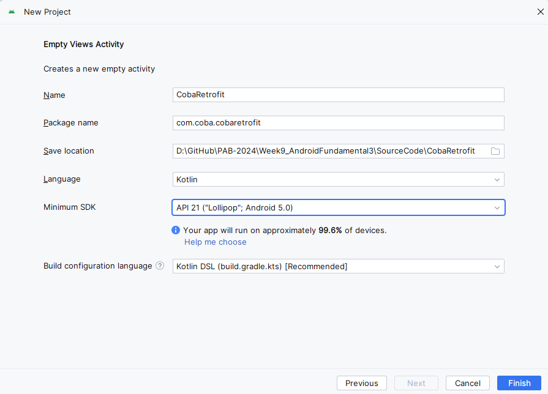

# CoddeLab Networking dengan library Retrofit
1. Buatlah project baru di android studio, dengan ketentuan seperti gambar berikut ini:
   
   Bisa diganti, jika ada yang perlu diganti.

2. API yang akan digunakan, yaitu:
    - https://jsonplaceholder.typicode.com/users

3. Buka url dummy public API di atas pada browser, install ekstensi JSON Formatter agar lebih mudah untuk dibaca.

4. Tambahkan kode di bawah ini, yang merupakan library retrofit, gson, dan interceptor, pada **build.gradle.kts(Module: app)**, lalu pilih **sync now** tunggu sampai proses sinkronisasi gradle selesai.

   ```
   dependencies {
        ...
        implementation("com.squareup.retrofit2:retrofit:2.6.1")
        implementation("com.squareup.retrofit2:converter-gson:2.6.1")
        implementation("com.squareup.okhttp3:logging-interceptor:4.2.0")
   }
   ```

5. Karena dalam mengambil data melalui Web API ini memerlukan internet, maka tambahkan kode permission berikut pada AndroidManifest seperti berikut:

   ```
   <?xml version="1.0" encoding="utf-8"?>
   <manifest xmlns:android="http://schemas.android.com/apk/res/android"
       xmlns:tools="http://schemas.android.com/tools"

       <uses-permission android:name="android.permission.INTERNET" />

       <application
           ...
       </application>
   </manifest>
   ```

6. Buatlah package bernama **data** pada package utama, dengan cara klik kanan pada package utama -> new -> package, seperti gambar berikut:
    

    Agar tampilan folder menjadi lebih mudah dibaca, uncheck **compact middle package**, dengan memilih ikon titik 3 di samping folder android, seperti pada gambar berikut:
    

    Buatlah package bernama **response** pada package response, lalu buatlah class model dengan nama **UserResponse** pada package response ini yang akan digunakan untuk menampung respon dari API. Pada class model ini, tambahkan kode seperti di bawah ini:
    ```
    data class UserResponse (
        @field:SerializedName("website")
        val website: String,

        @field:SerializedName("phone")
        val phone: String,

        @field:SerializedName("name")
        val name: String,

        @field:SerializedName("id")
        val id: Int,

        @field:SerializedName("email")
        val email: String,

        @field:SerializedName("username")
        val username: String
    )
    ```
    Kode di atas digunakan untuk mengonversi data JSON menjadi objek Kotlin. Setiap properti dari data class ini memiliki anotasi @SerializedName yang digunakan untuk menentukan nama key pada JSON yang akan diambil nilainya. Properti-properit ini mencakup website, phone, name, id, email, dan username.

    Pembuatan class model ini berdasarkan dummy public api yang digunakan pada poin 2. Bisa juga menggunakan plugin RojoPojoGenerator untuk pembuatan secara otomatis.

7. Buatlah package bernama **retrofit** pada package data, lalu buatlah class dengan nama **ApiService** pada package response ini. Pada class ini tambahkan kode seperti di bawah ini:
    ```
    interface ApiService {
        @GET("users")
        fun getUsers(): Call<ArrayList<UserResponse>>
    }
    ```

    Kode di atas mendefinisikan sebuah service untuk melakukan HTTP GET request pada endpoint "users". Fungsi getUsers() mengembalikan objek Call<ArrayList<UserResponse>>, yang akan digunakan untuk melakukan request dan menerima response berupa daftar objek UserResponse dalam bentuk array list.

8. Masih di package retrofit, buatlah class bernama **ApiConfig**, lalu tambahkan kode seperti di bawah ini:
    ```
    class ApiConfig {
        companion object{
            fun apiService(): ApiService {
                val loggingInterceptor =
                    HttpLoggingInterceptor().setLevel(HttpLoggingInterceptor.Level.BODY)
                val client = OkHttpClient.Builder()
                    .addInterceptor(loggingInterceptor)
                    .build()
                val retrofit = Retrofit.Builder()
                    .baseUrl("https://jsonplaceholder.typicode.com/")
                    .addConverterFactory(GsonConverterFactory.create())
                    .client(client)
                    .build()
                return retrofit.create(ApiService::class.java)
            }
        }
    }
    ```
    Kelas ApiConfig adalah sebuah utilitas untuk mengkonfigurasi Retrofit dalam proyek Android. Kelas ini memiliki companion object yang berisi fungsi apiService() yang mengembalikan objek ApiService. Fungsi ini menggunakan OkHttpClient untuk menambahkan interceptor yang digunakan untuk logging HTTP request dan response. Selain itu, fungsi ini juga menggunakan Retrofit.Builder() untuk mengkonfigurasi base URL, converter factory untuk Gson, dan client yang telah dikonfigurasi sebelumnya. Akhirnya, fungsi ini mengembalikan objek ApiService yang siap digunakan untuk melakukan request ke API.

    Kelas ini akan membuat kode menjadi lebih efektif karena tidak perlu membuat konfigurasi Retrofit baru setiap kali membutuhkannya, tetapi cukup memanggil fungsi yang ada di dalam class ini saja.

9. Buatlah package bernama **ui** pada package utama, lalu pindahkan MainActivity ke package ini. Package-package yang telah dibuat ini bertujuan agar lebih mudah dalam membaca dan mengelola kode.

10. Buka activiy_main.xml, lalu buatlah tampilan layoout nya seperti ini:
    ```
    <?xml version="1.0" encoding="utf-8"?>
    <LinearLayout xmlns:android="http://schemas.android.com/apk/res/android"
        xmlns:tools="http://schemas.android.com/tools"
        android:id="@+id/main"
        android:layout_width="match_parent"
        android:layout_height="match_parent"
        tools:context=".ui.MainActivity">

        <androidx.recyclerview.widget.RecyclerView
            android:id="@+id/rvUser"
            android:layout_width="match_parent"
            android:layout_height="wrap_content"
            tools:listitem="@layout/item_user"
            linearLayoutManager="androidx.recyclerview.widget.LinearLayoutManager">

        </androidx.recyclerview.widget.RecyclerView>

    </LinearLayout>
    ```

11. Buat layout baru dengan cara klik kanan pada folder layout → New → Layout resource file dan beri nama **item_user.xml**, lalu ketikan seperti berikut:
    ```
    <?xml version="1.0" encoding="utf-8"?>
    <androidx.cardview.widget.CardView xmlns:android="http://schemas.android.com/apk/res/android"
        android:id="@+id/cvUser"
        android:layout_width="match_parent"
        android:layout_height="180dp"
        android:layout_margin="12dp"
        xmlns:app="http://schemas.android.com/apk/res-auto"
        app:cardElevation="12dp"
        app:cardCornerRadius="7dp">

        <LinearLayout
            android:layout_width="match_parent"
            android:layout_height="match_parent"
            android:orientation="vertical"
            android:layout_margin="7dp"
            android:weightSum="6"
            android:gravity="center">

            <TextView
                android:id="@+id/tvId"
                android:layout_width="match_parent"
                android:layout_height="wrap_content"
                android:text="@string/id_user"/>

            <TextView
                android:id="@+id/tvName"
                android:layout_width="match_parent"
                android:layout_height="wrap_content"
                android:text="@string/name_user"/>

            <TextView
                android:id="@+id/tvUsername"
                android:layout_width="match_parent"
                android:layout_height="wrap_content"
                android:text="@string/username_user"/>

            <TextView
                android:id="@+id/tvPhone"
                android:layout_width="match_parent"
                android:layout_height="wrap_content"
                android:text="@string/phone_user"/>

            <TextView
                android:id="@+id/tvEmail"
                android:layout_width="match_parent"
                android:layout_height="wrap_content"
                android:text="@string/email_user"/>

            <TextView
                android:id="@+id/tvWeb"
                android:layout_width="match_parent"
                android:layout_height="wrap_content"
                android:text="@string/website_user"/>

        </LinearLayout>

    </androidx.cardview.widget.CardView>
    ```
    Jangan lupa untuk menambahkan string resource seperti berikut:
    ```
    <resources>
        <string name="app_name">CobaRetrofit</string>
        <string name="id_user">Id User</string>
        <string name="name_user">Name User</string>
        <string name="username_user">Username User</string>
        <string name="phone_user">Phone User</string>
        <string name="email_user">Email User</string>
        <string name="website_user">Website User</string>
    </resources>
    ```

12. Buat class UsersAdapter pada package ui yang telah dibuat pada poin 9, lalu isikan seperti berikut :
    ```
    class UserAdapter (
        private val context: Context,
        private val data: ArrayList<UserResponse>
    ): RecyclerView.Adapter<UserAdapter.UserViewHolder>() {
        class UserViewHolder(view: View): RecyclerView.ViewHolder(view) {
            val tvId = view.findViewById<TextView>(R.id.tvId)
            val tvName = view.findViewById<TextView>(R.id.tvName)
            val tvUsername = view.findViewById<TextView>(R.id.tvUsername)
            val tvPhone = view.findViewById<TextView>(R.id.tvPhone)
            val tvEmail = view.findViewById<TextView>(R.id.tvEmail)
            val tvWeb = view.findViewById<TextView>(R.id.tvWeb)
            val cvUser = view.findViewById<CardView>(R.id.cvUser)
        }

        override fun onCreateViewHolder(parent: ViewGroup, viewType: Int): UserViewHolder {
            val layoutInflater = LayoutInflater.from(parent.context)
            val itemView = layoutInflater.inflate(R.layout.item_user, parent, false)

            return UserViewHolder(itemView)
        }

        override fun onBindViewHolder(holder: UserViewHolder, position: Int) {
            holder.tvId.text = data.get(position).id.toString()
            holder.tvName.text = data.get(position).name
            holder.tvUsername.text = data.get(position).username
            holder.tvPhone.text = data.get(position).phone
            holder.tvEmail.text = data.get(position).email
            holder.tvWeb.text = data.get(position).website
            holder.cvUser.setOnClickListener {
                Toast.makeText(context, "" + data.get(position).username, Toast.LENGTH_SHORT).show()
            }
        }

        override fun getItemCount(): Int = data.size

        fun setData(newData: ArrayList<UserResponse>) {
            data.clear()
            data.addAll(newData)
            notifyDataSetChanged()
        }
    }
    ```

    Kelas UserAdapter adalah sebuah adapter yang digunakan untuk menampilkan data UserResponse dalam sebuah RecyclerView. Kelas ini menerima Context dan sebuah ArrayList dari UserResponse sebagai parameter konstruktor.

    Penjelasan beberapa kode di atas adalah sebagai berikut:
    1. Kelas ini mengimplementasikan RecyclerView.Adapter<UserAdapter.UserViewHolder>() yang memiliki inner class UserViewHolder untuk mendefinisikan tampilan setiap item di dalam RecyclerView.
    2. Metode onCreateViewHolder digunakan untuk membuat ViewHolder baru berdasarkan layout item_user.
    3. Metode onBindViewHolder digunakan untuk mengikat data dari ArrayList data ke ViewHolder.
    4. Metode getItemCount mengembalikan jumlah item dalam ArrayList data.
    5. Metode setData digunakan untuk mengganti data di dalam adapter dengan data baru, kemudian memberi tahu adapter bahwa dataset telah berubah sehingga RecyclerView dapat diperbarui dengan memanggil notifyDataSetChanged().

    Kelas ini digunakan untuk mengatur bagaimana data UserResponse ditampilkan dalam RecyclerView.

13. Bagian selanjutnya adalah proses mengambil data dengan retrofit dan menampilkannya di MainActivity, ketikkan kodenya seperti berikut:
    ```
    class MainActivity : AppCompatActivity() {

        private lateinit var binding: ActivityMainBinding
        private lateinit var adapter: UserAdapter

        override fun onCreate(savedInstanceState: Bundle?) {
            super.onCreate(savedInstanceState)

            binding = ActivityMainBinding.inflate(layoutInflater)

            setContentView(binding.root)

            adapter = UserAdapter(this@MainActivity, arrayListOf())

            binding.rvUser.adapter = adapter
            binding.rvUser.setHasFixedSize(true)
            binding.rvUser.layoutManager = LinearLayoutManager(this)

            getUsers()
        }

        fun getUsers() {
            ApiConfig.apiService().getUsers().enqueue(object : Callback<ArrayList<UserResponse>> {
                override fun onResponse(
                    call: Call<ArrayList<UserResponse>>,
                    response: Response<ArrayList<UserResponse>>
                ) {
                    if (response.isSuccessful) {
                        val data = response.body()
                        data?.let {
                            setData(it)
                        }
                    }
                }

                override fun onFailure(call: Call<ArrayList<UserResponse>>, t: Throwable) {
                    Log.d("Error", "" + t.stackTraceToString())
                }
            })
        }

        fun setData(data: ArrayList<UserResponse>) {
            adapter.setData(data)
        }
    }
    ```

    Penjelasan beberapa kode di atas adalah sebagai berikut:
    1. Pada method onCreate, layout activity_main diinflate menggunakan ActivityMainBinding, kemudian RecyclerView diatur dengan adapter kosong.
    2. Method getUsers digunakan untuk mengambil data pengguna menggunakan Retrofit. Jika responsenya berhasil, data ditetapkan ke dalam adapter menggunakan method setData.
    3. Method setData digunakan untuk mengatur data baru ke dalam adapter dan memberitahu adapter bahwa dataset telah berubah, sehingga RecyclerView dapat diperbarui.
    
    Kelas ini memanfaatkan Retrofit untuk melakukan request ke API dan menampilkan data pengguna dalam RecyclerView menggunakan adapter UserAdapter.

14. Jalankan aplikasi, maka akan terlihat seperti ini:
    

Selanjutnya dapat dilihat full kodenya di folder berikut **Week9_AndroidFundamental3/SourceCode/CobaRetrofit**

## Penutup
Berhubung materi yang telah di sampaikan di atas merupakan hal dasar, kalian dapat mengeksplorasinya sendiri (artikel di internet, buku, atau yang lainnya) untuk menambah pengetahuan dan pemahaman masing-masing.