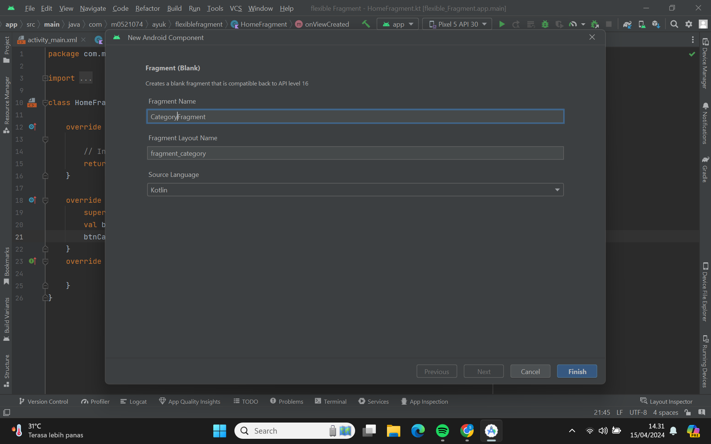
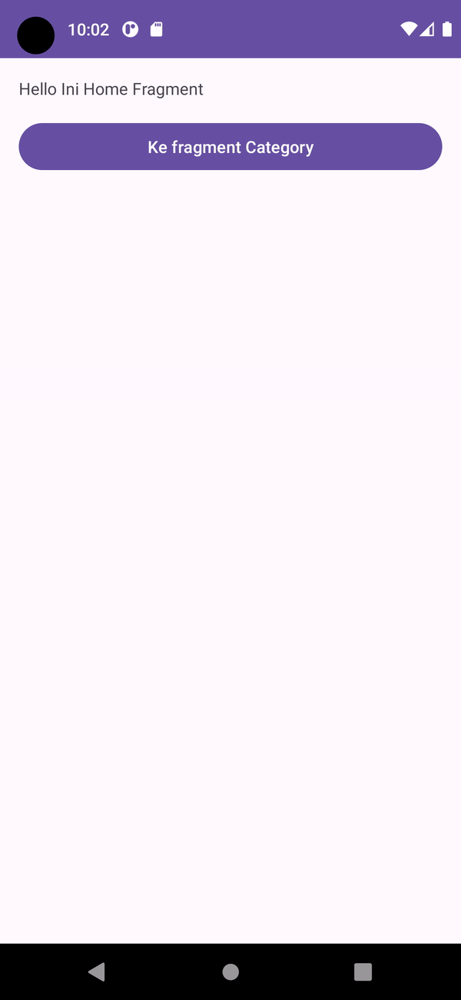

## FLEXIBLE FRAGMENT IN ONE ACTIVITY

Selanjutnya kita akan membuat fragment baru yang fleksibel.

1. Kita akan membuat di file yang sama, jadi silahkan buka file projek **flexibleFragment** kalian.

2. Dengan cara yang sama seperti sebelumnya, dengan klik kanan pada package utama pada proyek aplikasi Anda → **New → Fragment → Fragment (Blank).** Lalu kemudian buat fragment baru dengan nama **CategoryFragment**.




3. Pada file **fragment_category.xml** silahkan diubah seperti berikut.

```kotlin
<LinearLayout xmlns:android="http://schemas.android.com/apk/res/android"
    xmlns:tools="http://schemas.android.com/tools"
    android:layout_width="match_parent"
    android:layout_height="match_parent"
    android:orientation="vertical"
    android:padding="16dp">
 
    <TextView
        android:layout_width="match_parent"
        android:layout_height="wrap_content"
        android:layout_marginBottom="16dp"
        android:text="@string/this_category" />
    <Button
        android:id="@+id/btn_detail_category"
        android:layout_width="match_parent"
        android:layout_height="wrap_content"
        android:text="@string/category_lifestyle" />
</LinearLayout>
```

4. Selesai dengan layout xml, kini pada berkas **CategoryFragment** modifikasi kodenya menjadi sebagai berikut:

```kotlin
class CategoryFragment : Fragment(), View.OnClickListener {
 
    override fun onCreateView(inflater: LayoutInflater, container: ViewGroup?,
                              savedInstanceState: Bundle?): View? {
        // Inflate the layout for this fragment
        return inflater.inflate(R.layout.fragment_category, container, false)
    }
 
    override fun onViewCreated(view: View, savedInstanceState: Bundle?) {
        super.onViewCreated(view, savedInstanceState)
        val btnDetailCategory:Button = view.findViewById(R.id.btn_detail_category)
        btnDetailCategory.setOnClickListener(this)
    }
 
    override fun onClick(v: View?) {
        if (v?.id == R.id.btn_detail_category) {
  
        }
    }
}
```
Sama seperti sebelumnya, kita siapkan **onClick** untuk modul berikutnya yaitu **"Mengirim Data Antar Fragment"**.

5. Sekarang kembali pada **HomeFragment**. Tambahkan baris berikut pada metode **onClick()**.

```kotlin
override fun onClick(v: View?) {
    if (v?.id == R.id.btn_category) {
        val categoryFragment = CategoryFragment()
        val fragmentManager = parentFragmentManager
        fragmentManager.beginTransaction().apply {
            replace(R.id.frame_container, categoryFragment, CategoryFragment::class.java.simpleName)
            addToBackStack(null)
            commit()
        }
    }
}
```

6.  Sehingga kode dari **HomeFragment** menjadi seperti berikut:

```kotlin
class HomeFragment : Fragment(), View.OnClickListener {
 
    override fun onCreateView(inflater: LayoutInflater, container: ViewGroup?,
                              savedInstanceState: Bundle?): View? {
        // Inflate the layout for this fragment
        return inflater.inflate(R.layout.fragment_home, container, false)
    }
 
    override fun onViewCreated(view: View, savedInstanceState: Bundle?) {
        super.onViewCreated(view, savedInstanceState)
        val btnCategory:Button = view.findViewById(R.id.btn_category)
        btnCategory.setOnClickListener(this)
    }
 
    override fun onClick(v: View?) {
        if (v.id == R.id.btn_category) {
            val categoryFragment = CategoryFragment()
            val fragmentManager = parentFragmentManager
            fragmentManager.beginTransaction().apply {
                replace(R.id.frame_container, categoryFragment, CategoryFragment::class.java.simpleName)
                addToBackStack(null)
                commit()
            }
        }
    }
}
```

-    Apabila Activity memanfaatkan **supportFragmentManager**, Fragment menggunakan **parentFragmentManager** untuk mendapatkan *FragmentManager* dari Activity. Setelahnya dapat terjadi transaksi pergantian fragment.

```kotlin
val categoryFragment = CategoryFragment()
val fragmentManager = parentFragmentManager
fragmentManager.beginTransaction().apply {
    replace(R.id.frame_container, categoryFragment, CategoryFragment::class.java.simpleName)
    addToBackStack(null)
    commit()
}
```
-    ***Note***    : Perhatikan kode di atas, perbedaannya terletak pada *method* yang dipakai, yaitu **replace()** dan bukan lagi **add** ketika ingin menempellkan sebuah fragment baru. Kedua *method* dengan parameter input yang sama akan mengganti objek fragment yang sedang tampil, yaitu **HomeFragment** dengan objek fragment baru, yaitu **CategoryFragment**.
  
-    ***Note***    : Karena objek fragment akan masuk ke dalam sebuah fragment *stack*, maka kita harus menaruh **.addToBackStack(null)** setelah menginisialisasi *method* nya. Nantinya ketika kita tekan tombol *back*, ia akan *pop-out* keluar dari *stack* dan menampilkan objek fragment sebelumnya **HomeFragment**. Akan tetapi ketika **.addToBackStack(null)** dihapus dan menjalankan ulang aplikasinya, dan kemudian klik tombol back pada peranti, maka aplikasi akan langsung tertutup. Kalian dapat mencobanya sendiri dan lihat perbedaan nya.

7.  Setelah selesai, jalankan aplikasi. Klik tombol **Ke fragment Category**. Aplikasi telah dapat berpindah tampilan tanpa berpindah activity.


